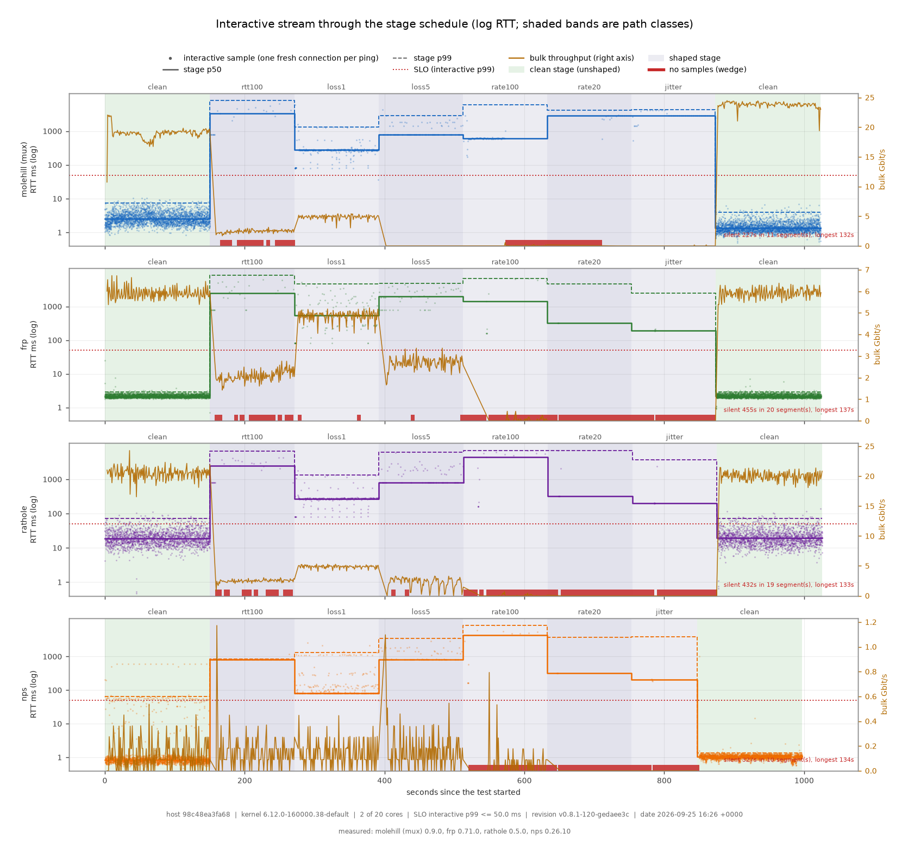
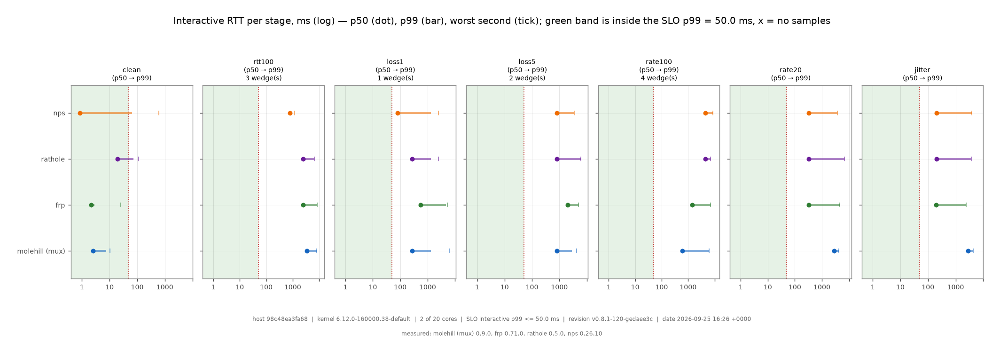

<p align="center">
  
</p>

<h1 align="center">molehill</h1>

<p align="center">
  <a href="LICENSE"></a>
  
  
  
</p>
<p align="center">
  
  
  
</p>

<p align="center">A secure, stable, high-performance reverse proxy for NAT traversal.</p>

[English](README.md) | [简体中文](README.zh.md)

molehill, like [frp](https://github.com/fatedier/frp) and [ngrok](https://github.com/inconshreveable/ngrok), can help to expose the service on the device behind the NAT to the Internet, via a server with a public IP.

<!-- TOC -->

- [molehill](#molehill)
  - [Features](#features)
  - [Benchmarks](#benchmarks)
    - [Choosing a configuration](#choosing-a-configuration)
    - [molehill vs the plain-TCP peers](#molehill-vs-the-plain-tcp-peers)
  - [Quickstart](#quickstart)
  - [Deployment](#deployment)
    - [Binary](#binary)
    - [systemd](#systemd)
    - [Container](#container)
  - [Configuration](#configuration)
  - [Documentation](#documentation)
  - [Development](#development)

<!-- /TOC -->

## Features

- **High Performance** Much higher throughput can be achieved than frp, and more stable when handling a large volume of connections.
- **Low Resource Consumption** Consumes much fewer memory than similar tools. [The binary can be](docs/build-guide.md) **as small as ~500KiB** to fit the constraints of devices, like embedded devices as routers.
- **Client-Authoritative Services** Since v0.7 the server needs no per-service configuration: clients declare what to expose (including the public port) and the server enforces an `allow_ports` whitelist. One shared token authenticates everything.
- **Multiplexing** Every data channel rides as a yamux stream over one of N parallel tunnel connections by default (`[client.data].default_count = 4`) — no per-connection handshakes, dramatically fewer file descriptors, throughput beyond a single TCP flow, and head-of-line isolation (a lost segment stalls only its own tunnel). The optional `default_carrier = "kcp"` (feature `kcp`) moves the data plane onto KCP-over-UDP sessions. The `[client.data]` default knobs and the `mode = "direct"` fallback are covered in [Configuration](./docs/configuration.md).
- **Security** A shared token is mandatory and the `allow_ports` whitelist bounds what any client can expose. The optional Noise Protocol encrypts the wire with a single pre-shared X25519 keypair — no PKI, no CA — and, with `resume = true`, proves a reconnect with a MAC instead of repeating the handshake's key exchanges (connection setup 442.7 -> 38.5 us per pair). `plain` forwards unencrypted.
- **Hot Reload** Services can be added or removed dynamically by hot-reloading the configuration file.

## Benchmarks

Single-machine comparison (`visitor -> server -> client -> backend`, all four
hops on one machine). Everything is measured **through the tunnel**: the probes
dial each tool's exposed port, never the backend it forwards to. The peers are
the latest GitHub release builds (frp, rathole upstream, nps, versions recorded
with each run). Every tool is driven through the identical workload while the
network condition follows a scripted stage schedule, changed in place, so a
tool's session is never rebuilt — how it adapts to a degrading and then
recovering path is part of the measurement.

### Choosing a configuration

The defaults — `mode = "multiplex"`, `count = 4`, `carrier = "tcp"`, plain
transport — are the right starting point for almost everyone. Deviate only
when the tree says so. How to apply each choice: the `[client.data]` block
holds the per-client defaults, and every service can override `mode` /
`count` / `carrier` on its own `[client.services.<name>]` block — one client
can mix a multiplexed interactive service with a `direct` bulk service, and
can even point individual services at different molehill servers via
`remote_addr`. The `[transport]` block is in
[Configuration](docs/configuration.md); Noise keypairs in
[Transport](docs/transport.md).

**How to choose, step by step.** Start from the defaults and answer three
questions about your workload; change one thing at a time and re-test:

1. **Do you need encryption?** Yes → set `[client.transport] type =
   "noise"` and place the keys. No → keep `"plain"`.
2. **One user or many, and how many concurrent connections?** A single
   long-lived session (SSH, one Minecraft player) → `direct` or the default
   mux both work; mux saves NAT mappings at low concurrency too. When that
   one stream must not be bounded by a single tunnel flow (bulk over one
   session), set `[server.data] stripe_count` (K=4) — the connection then
   rides K parallel data channels, at K× channels per visitor and a bounded
   reorder buffer. Many users / churn / multiple services → keep or raise
   `count` (each tunnel carries ~64 concurrent connections before the yamux
   ceiling — `count = 8` ≈ 512).
3. **What does the path look like, and do you forward UDP?** If TCP data
   tunnels are blocked or throttled, or you need latency-first UDP at high
   delay, A/B `carrier = "kcp"`. Otherwise keep the TCP carrier. For
   lossy/wifi paths keep `count >= 4` — it aggregates and isolates
   head-of-line blocking — and pick `count` for the per-tunnel connection
   ceiling (`count = 1 -> 64` connections, `count = 4 -> 256`).

Two numbers decide between these options, and they are best measured on your
own path rather than read off a table: the **sustainable load** (how many bulk
streams the tool carries while a fresh interactive connection still meets the
50 ms and 0.5 % errors) and the **cost at the operating point** (CPU-seconds per carried
Gbit/s). What the published runs measured, and how to run the same comparison
on your own hardware, is in [Benchmarks](docs/benchmarks.md); the settings
themselves are in [Configuration](docs/configuration.md#choosing-your-configuration-decision-tree).

### molehill vs the plain-TCP peers

Every tool is driven through the identical workload — one interactive stream
(the SLO instrument), N = 20 bulk TCP streams, 16 short connections per
second and one UDP session — while the path follows the stage schedule
(netem on `lo`, the control plane left unshaped). The chart below is the
v0.9.0 run on one host (molehill's default `multiplex`, `count = 4`, plain
transport): the orange line is the bulk throughput, the blue points the
interactive stream's RTT, the shaded bands the path classes, the dashed
line the SLO (p99 <= 50 ms).



The same run as small multiples — one panel per stage, a lollipop per tool
(dot = p50, bar = p99, tick = worst second), so "who wins which condition"
reads without a table:



**Interactive stream RTT p99, per stage** (ms; "wedge" = the stream produced
no response for > 5 s):

| tool | clean | rtt100 | loss1 | loss5 | rate100 | rate20 | jitter | clean (return) |
|---|---|---|---|---|---|---|---|---|
| **molehill (mux)** | **7.6** | wedge | 1334 | 3494 | wedge | 3123 | 4354 | **4.9** |
| frp 0.71.0 | **2.9** | wedge | 3900 | wedge | 162 | 3919 | 5007 | **2.9** |
| rathole 0.5.0 | 81 | wedge | 1311 | wedge | wedge | 2600 | 4675 | 78 |
| nps 0.26.10 | 74 | 856 | 1139 | 4270 | wedge | 3265 | 1785 | 82 |

**Bulk throughput per stage** (Gbit/s): molehill 17.0 on clean -> 2.4 at
rtt100 -> 0.02 at rate100 -> **20.1 on the return to clean**; frp 5.9 ->
2.2 -> 5.9; rathole 16.9 -> 2.5 -> 17.0; nps 0.14 throughout.

**What these shapes say.** Every tool degrades under a bad path and every
tool recovers on the return to clean — that recovery is what the last band
measures, and a tool that stayed wedged would be a finding. The interactive
stream's p99 is what a new visitor actually feels: under saturation it is
the number that separates tools, and it is where the throughput axis is
blind — molehill and rathole carry nearly the same bulk on the clean stage
(17.0 vs 16.9 Gbit/s) while a fresh interactive connection costs 7.6 ms
versus 81 ms, and on the 1%-loss cell both carry ~4.9 Gbit/s but the
interactive stream sits at 1334 ms versus 1311 ms. The peers are driven by
the same workload and charted in the same panels; the drift axis (open fds,
RSS and CPU slopes over the run) is in `soak-v0.9.0-drift.png` and the UDP
session's RTT/loss in `soak-v0.9.0-udp.png` (a sliding loss *rate*, not a
count of loss events).

These are v0.9.0 numbers from one host, and only runs of the same model on the
same host compare directly. How to read a chart in detail (the log axis, the
step lines, the wedge bars, what each band means), the stage schedule, the test
types and how to reproduce a run on your own hardware:
[Benchmarks](docs/benchmarks.md).

## Quickstart

A full-powered `molehill` can be obtained from the [release](https://github.com/NIyueeE/molehill/releases) page. Or [build from source](docs/build-guide.md) **for other platforms and minimizing the binary**.

Like frp, all service definitions live on the client side; the server only sets policy (a shared token and the `allow_ports` whitelist).

To use `molehill`, you need a server with a public IP, and a device behind the NAT, where some services that need to be exposed to the Internet.

Assuming you have a NAS at home behind the NAT, and want to expose its ssh service to the Internet:

1. On the server which has a public IP

Create `server.toml` with the following content and accommodate it to your needs.

```toml
# server.toml
[server]
default_token = "use_a_secret_that_only_you_know" # Shared secret with your clients # security-scan:allow documentation placeholder

# Master switch for dynamic registrations: only ports covered here can be claimed by clients
allow_ports = ["5202"]

[server.control]
bind_addr = "0.0.0.0:2333" # Port that molehill listens for clients
```

Then run:

```bash
./molehill server.toml
```

2. On the host which is behind the NAT (your NAS)

Create `client.toml` with the following content and accommodate it to your needs.

```toml
# client.toml
[client]
default_token = "use_a_secret_that_only_you_know" # Must match the server's `default_token` # security-scan:allow documentation placeholder

[client.control]
default_remote_addr = "myserver.com:2333" # The address of the server. The port must match `server.control.bind_addr`

[client.services.my_nas_ssh]
local_addr = "127.0.0.1:22" # The local service to forward
remote_bind_addr = "0.0.0.0:5202" # The public port to expose it at on the server
```

At startup the client registers `my_nas_ssh` on the server, which validates
the port against `allow_ports` and starts forwarding. Adding or removing
services in `client.toml` applies live via hot reload — no server-side edit
needed.

Then run:

```bash
./molehill client.toml
```

3. Now the client will try to connect to the server `myserver.com` on port `2333`, and any traffic to `myserver.com:5202` will be forwarded to the client's port `22`.

So you can `ssh -p 5202 myserver.com` to ssh to your NAS.

To run `molehill` as a background service on Linux, checkout the
[systemd units](./docs/configuration.md#systemd) or the
[container deployments](./docs/configuration.md#container).

## Configuration

`molehill` determines the running mode (server/client) from the config file
automatically, or you can force it with `--server` / `--client`. The full
configuration specification, logging and tuning options are documented in
[Configuration](./docs/configuration.md), which also includes
[complete examples](./docs/configuration.md#complete-examples) for various
scenarios.

## Deployment

### Binary

Download a pre-built binary for your platform from the
[release page](https://github.com/NIyueeE/molehill/releases), or
[build from source](./docs/build-guide.md) for other platforms and
minimal-sized binaries.

```bash
./molehill server.toml   # on the public server
./molehill client.toml   # on the device behind NAT
```

### systemd

The [systemd units](./docs/configuration.md#systemd) show how to run molehill as a
systemd service, both as root and rootless, including multiple instances.

### Container

Official multi-arch images (linux/amd64, linux/arm64) are published to
`ghcr.io/niyueee/molehill`. The image is a single static musl binary on
`scratch` (~1.2 MiB), runs as non-root UID 1000, and includes the same default
feature set as the regular release builds (multiplexing and the `kcp` carrier
included).

```bash
docker run -v /etc/molehill/server.toml:/app/server.toml:ro \
  ghcr.io/niyueee/molehill:latest server.toml
```

The image contains no configuration — mount your config file and pass its
name as the argument. Two container-specific notes: the process runs as UID
1000 (so mount the config world-readable, and prefer ports ≥ 1024), and under
bridge networking a `carrier = "kcp"` service needs its data-plane port
published over **UDP** as well. See the [container deployments](./docs/configuration.md#container)
for Docker Compose (`compose.yaml` / `compose.bridge.yaml`) and Podman
Quadlet (`molehill-server.container` / `molehill-client.container`)
deployments.

## Documentation

For people running molehill:

- [Configuration](./docs/configuration.md) — full configuration specification, logging, tuning
- [Transport](./docs/transport.md) — Noise Protocol setup
- [Benchmarks](./docs/benchmarks.md) — how the published numbers are produced, how to read them, how to reproduce them
- [Build guide](./docs/build-guide.md) — build customization, minimal binary
- [Internals](./docs/internals.md) — how control/data channels work
- [Configuration examples](./docs/configuration.md#complete-examples) — configs for common scenarios (systemd & container deployments included)

For people changing it (contributor and governance docs are English-only by
decision — see [AGENTS.md](./AGENTS.md) §3):

- [Checks](./docs/checks.md) — what every gate runs, how to handle a block
- [Lint policy](./docs/lint-policy.md) — lint levels and waiver rules
- [Release](./docs/release.md) — release mechanics, versioning, test builds
- [Structure](./docs/structure.md) — what every file in this repo is for
- [Contributing](./CONTRIBUTING.md) — setup and workflow
- [Security](./SECURITY.md) — reporting vulnerabilities
- [`HANDOFF.md`](./HANDOFF.md) — current working state; planned work and future design documents

## Development

molehill is written in Rust (2024 edition); `rust-toolchain.toml` declares
`channel = "stable"` with clippy and rustfmt components — never hardcode a
version. Layered git hooks guard every commit, push, and release tag, and CI
runs the identical chain for anything that touches code — a docs-only change
runs just the docs-alignment check (`docs.yml`) instead:

```bash
just setup   # activate git hooks (core.hooksPath githooks) + install check tools
just check   # fmt / secrets / machete / docs / ruff (check + format) / clippy + audit / deny / outdated / test
just tag     # release review (githooks/pre-tag) + create the local v* tag
```

molehill began as a fork of [rathole](https://github.com/rapiz1/rathole)
(Apache-2.0) and has been developed independently since; the upstream
history is preserved below the fork point and the version line continues
from there (upstream's last release was v0.5.0). See
[docs/release.md](./docs/release.md) for release mechanics and
[AGENTS.md](./AGENTS.md) for the repository rules.
