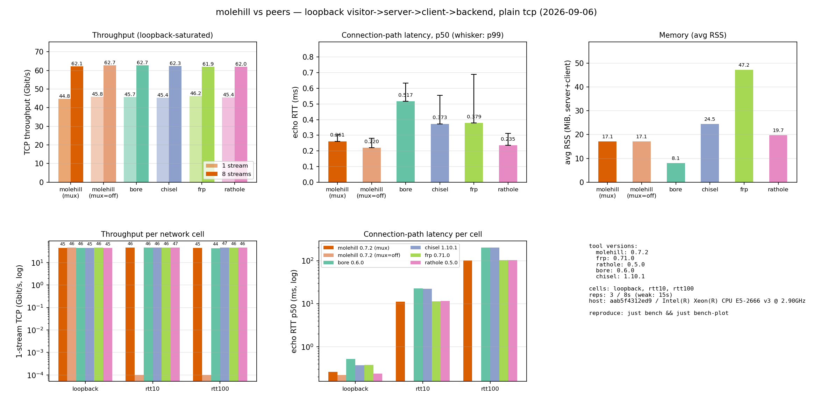
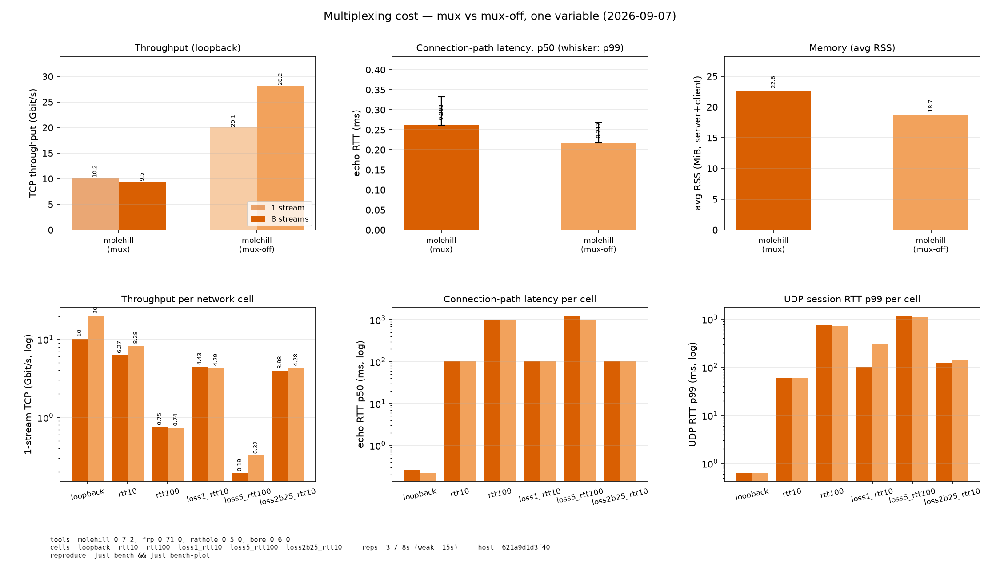
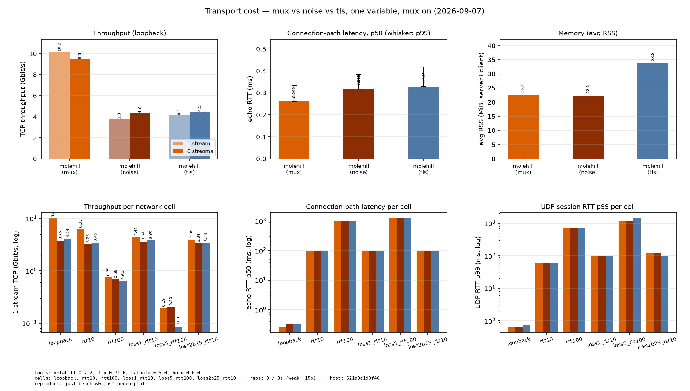

<p align="center">
  
</p>

<h1 align="center">molehill</h1>

<p align="center">
  <a href="LICENSE"></a>
  
  
  
</p>
<p align="center">
  
  
  
</p>

<p align="center">A community-maintained fork of <a href="https://github.com/rapiz1/rathole">rathole</a>.</p>

[English](README.md) | [简体中文](README.zh.md)

molehill, like [frp](https://github.com/fatedier/frp) and [ngrok](https://github.com/inconshreveable/ngrok), can help to expose the service on the device behind the NAT to the Internet, via a server with a public IP.

<!-- TOC -->

- [molehill](#molehill)
  - [Features](#features)
  - [Quickstart](#quickstart)
  - [Deployment](#deployment)
    - [Binary](#binary)
    - [systemd](#systemd)
    - [Container](#container)
  - [Configuration](#configuration)
  - [Documentation](#documentation)
  - [Development](#development)

<!-- /TOC -->

## Features

- **High Performance** Much higher throughput can be achieved than frp, and more stable when handling a large volume of connections.
- **Low Resource Consumption** Consumes much fewer memory than similar tools. [The binary can be](docs/build-guide.md) **as small as ~500KiB** to fit the constraints of devices, like embedded devices as routers.
- **Client-Authoritative Services** Since v0.7 the server needs no per-service configuration: clients declare what to expose (including the public port) and the server enforces an `allow_ports` whitelist. One shared token authenticates everything.
- **Multiplexing** Every data channel rides as a yamux stream over one tunnel connection by default — no per-connection handshakes and dramatically fewer file descriptors. The `mux` knobs and the `mux = false` fallback are covered in [Configuration](./docs/configuration.md).
- **Security** A shared token is mandatory and the `allow_ports` whitelist bounds what any client can expose. With the optional Noise Protocol, encryption can be configured at ease. No need to create a self-signed certificate! TLS is also supported.
- **Hot Reload** Services can be added or removed dynamically by hot-reloading the configuration file.

## Benchmarks

Peer comparison on one machine (plain TCP, `visitor -> server -> client ->
backend` on loopback; everything is measured **through the tunnel** — iperf3
dials each tool's exposed port). Peers are the latest GitHub release builds:
frp 0.71.0, rathole 0.5.0 (upstream), bore 0.6.0.
Weak-network cells apply netem to the loopback interface, so every leg of
the path is delayed or lossy — identical for all tools (a "10 ms" cell
therefore shows ~100 ms echo RTT through the multi-leg path; the
amplification is per-leg and tool-independent).

### molehill vs plain-TCP peers

The comparison chart is deliberately restricted to the **plain-TCP axis**:
molehill's default configuration (mux on, no encryption) against the peers
with the same transport properties. Encrypted competitors (e.g. chisel's
built-in SSH tunnel) are excluded — their numbers are not comparable here,
and molehill's own encrypted variants are isolated in the chart below.



Through-tunnel throughput separates the tools: the `mux` arm rides one yamux
channel (per-stream ceiling), the peers open a channel per connection:

| Tool | 1-stream (Gbit/s) | 8-stream (Gbit/s) | echo RTT p50 | echo RTT p99 | Memory (avg RSS) |
|---|---|---|---|---|---|
| **molehill 0.7.2** (mux, default) | 10.2 | 9.5 | 0.262 ms | 0.333 ms | 22.6 MiB |
| rathole 0.5.0 (upstream) | 12.4 | 26.8 | 0.234 ms | 0.312 ms | 20.0 MiB |
| bore 0.6.0 | 14.2 | 27.0 | 0.495 ms | 0.629 ms | **8.4 MiB** |
| frp 0.71.0 | 4.8 | 6.3 | 0.375 ms | 0.673 ms | 72.1 MiB |

- The multiplexed single-tunnel path (mux) tops out around 10 Gbit/s per
  stream; the per-connection architectures (rathole, bore) reach 12–14.
- bore is the lightest (8.4 MiB) and a strong plain TCP relay — but no UDP
  forwarding at all.
- frp pays the highest memory (72 MiB) for the lowest throughput here.

Weak-network cells (netem on every loopback leg): connection-path RTT under
added delay; bore pays two or more extra round trips (its local forward
dials through the control port each time), the pre-established channel pool
pays the baseline only:

| Tool | rtt10: echo RTT p50 | rtt100: echo RTT p50 | rtt10: 1-stream (Gbit/s) |
|---|---|---|---|
| **molehill 0.7.2** (mux, default) | **101.3 ms** | **1001.4 ms** | 6.3 |
| rathole 0.5.0 (upstream) | 101.1 ms | 1001.3 ms | 6.3 |
| bore 0.6.0 | 141.8 ms | 1402.0 ms | 10.2 |
| frp 0.71.0 | 101.5 ms | 1001.6 ms | 1.8 |

| Tool | loss 1%: 1-stream (Gbit/s) | UDP session loss | UDP max gap |
|---|---|---|---|
| **molehill 0.7.2** (mux, default) | **4.4** | 5.0% | 61 ms |
| rathole 0.5.0 (upstream) | 4.3 | 6.0% | 60 ms |
| bore 0.6.0 | 4.6 | - (no UDP) | - |
| frp 0.71.0 | 0.8 | 3.5% | 60 ms |

- Under 1% loss the multiplexed/pooled data paths (molehill, rathole) and
  the plain relay (bore) hold 4.3–4.6 Gbit/s while frp (0.8) collapses —
  loss tolerance separates forwarding architectures more sharply than raw
  loopback speed.
- UDP session quality degrades gracefully for every tool that forwards UDP:
  ≤6% residual loss (the shared qdisc spreads the configured 1% unevenly)
  and ≤61 ms worst inter-packet gap — a game-like session survives.

### molehill: multiplexing cost (mux vs mux-off)

One binary, **one variable** — multiplexing on/off; `mux` is the control.
Loopback plus every weak cell.



| Configuration | 1-stream (Gbit/s) | 8-stream (Gbit/s) | echo RTT p50 | echo RTT p99 | Memory (avg RSS) |
|---|---|---|---|---|---|
| **mux (default)** | 10.2 | 9.5 | 0.262 ms | 0.333 ms | 22.6 MiB |
| `mux = false` | 20.1 | 28.2 | 0.217 ms | 0.268 ms | 18.7 MiB |

| Cell | mux 1-str | mux-off 1-str | mux 8-str | mux-off 8-str |
|---|---|---|---|---|
| loopback | 10.2 | 20.1 | 9.5 | 28.2 |
| rtt10 | 6.3 | 8.3 | 5.9 | 10.1 |
| rtt100 | 0.75 | 0.74 | 1.0 | 1.3 |
| loss 1% | 4.4 | 4.3 | 4.7 | 18.5 |
| loss 5% | 0.19 | 0.32 | 0.31 | 1.49 |
| loss 2% burst | 4.0 | 4.3 | 4.3 | 18.7 |

- Multiplexing trades single-stream throughput for connection efficiency:
  with `mux = false` the same binary does 20.1 / 28.2 Gbit/s on loopback.
- Under pure delay the gap narrows (rtt100 single-stream is a tie) — the
  per-connection cost is amortized once RTT dominates.
- **Under loss the gap inverts for concurrent streams**: the single tunnel
  shares one loss/retransmit domain (all streams stall together), while
  `mux = false` retransmits per stream — at 1% loss, 8-stream throughput is
  18.5 Gbit/s for mux-off vs 4.7 for mux. Single-stream loss behavior is
  nearly identical; the multiplexing penalty shows up exactly where the
  tunnel shares one fate domain.

### molehill: transport cost (mux vs noise vs tls)

One binary, **one variable** — the encrypted transport (Noise / TLS vs
plain TCP), multiplexing on for all three; `mux` is the shared control.



| Configuration | 1-stream (Gbit/s) | 8-stream (Gbit/s) | echo RTT p50 | echo RTT p99 | Memory (avg RSS) |
|---|---|---|---|---|---|
| **mux (plain TCP)** | 10.2 | 9.5 | 0.262 ms | 0.333 ms | 22.6 MiB |
| noise | 3.8 | 4.3 | 0.318 ms | 0.383 ms | 22.3 MiB |
| tls | 4.1 | 4.5 | 0.327 ms | 0.419 ms | 33.8 MiB |

- Encryption halves throughput: noise (3.8) and tls (4.1) both sit at
  roughly half of the plain mux row, while the connection-path overhead
  stays sub-millisecond. TLS carries the extra memory (33.8 MiB).
- In the weak cells the encrypted rows track the plain row: loss 1% keeps
  3.6–3.8 Gbit/s for all three variants; the transport choice does not
  change loss behavior.

- Absolute numbers are host-dependent; the comparison is same-host and
  same-methodology. Reproduce: `just bench-peers` → `just bench` →
  `just bench-plot` → `just bench-check` (raw data in
  `benches/scripts/bench/results-v0.7.2.json`; ritual and regression gate in
  docs/release.md).

## Quickstart

A full-powered `molehill` can be obtained from the [release](https://github.com/NIyueeE/molehill/releases) page. Or [build from source](docs/build-guide.md) **for other platforms and minimizing the binary**.

Like frp, all service definitions live on the client side; the server only sets policy (a shared token and the `allow_ports` whitelist).

To use `molehill`, you need a server with a public IP, and a device behind the NAT, where some services that need to be exposed to the Internet.

Assuming you have a NAS at home behind the NAT, and want to expose its ssh service to the Internet:

1. On the server which has a public IP

Create `server.toml` with the following content and accommodate it to your needs.

```toml
# server.toml
[server]
bind_addr = "0.0.0.0:2333" # Port that molehill listens for clients
default_token = "use_a_secret_that_only_you_know" # Shared secret with your clients

# Master switch for dynamic registrations: only ports covered here can be claimed by clients
allow_ports = ["5202"]
```

Then run:

```bash
./molehill server.toml
```

2. On the host which is behind the NAT (your NAS)

Create `client.toml` with the following content and accommodate it to your needs.

```toml
# client.toml
[client]
remote_addr = "myserver.com:2333" # The address of the server. The port must match `server.bind_addr`
default_token = "use_a_secret_that_only_you_know" # Must match the server's `default_token`

[client.services.my_nas_ssh]
local_addr = "127.0.0.1:22" # The local service to forward
remote_bind_addr = "0.0.0.0:5202" # The public port to expose it at on the server
```

At startup the client registers `my_nas_ssh` on the server, which validates
the port against `allow_ports` and starts forwarding. Adding or removing
services in `client.toml` applies live via hot reload — no server-side edit
needed.

Then run:

```bash
./molehill client.toml
```

3. Now the client will try to connect to the server `myserver.com` on port `2333`, and any traffic to `myserver.com:5202` will be forwarded to the client's port `22`.

So you can `ssh myserver.com:5202` to ssh to your NAS.

To run `molehill` as a background service on Linux, checkout the
[systemd examples](./examples/systemd) or the
[container examples](./examples/container).

## Configuration

`molehill` determines the running mode (server/client) from the config file
automatically, or you can force it with `--server` / `--client`. The full
configuration specification, logging and tuning options are documented in
[Configuration](./docs/configuration.md). [Example configs](./examples) for
various scenarios are also available.

## Deployment

### Binary

Download a pre-built binary for your platform from the
[release page](https://github.com/NIyueeE/molehill/releases), or
[build from source](./docs/build-guide.md) for other platforms and
minimal-sized binaries.

```bash
./molehill server.toml   # on the public server
./molehill client.toml   # on the device behind NAT
```

### systemd

The [systemd examples](./examples/systemd) show how to run molehill as a
systemd service, both as root and rootless, including multiple instances.

### Container

Official multi-arch images (linux/amd64, linux/arm64) are published to
`ghcr.io/niyueee/molehill`. The image is a single static musl binary on
`scratch` (~8 MiB), runs as non-root UID 1000, bundles CA certificates for
TLS verification, and includes the same default feature set as the regular
release builds (multiplexing enabled).

```bash
docker run -v /etc/molehill/server.toml:/app/server.toml:ro \
  ghcr.io/niyueee/molehill:latest server.toml
```

The image contains no configuration — mount your config file and pass its
name as the argument. See the [container examples](./examples/container)
for Docker Compose (`compose.yaml` / `compose.bridge.yaml`) and Podman
Quadlet (`molehill-server.container` / `molehill-client.container`)
deployments.

## Documentation

Using molehill:

- [Configuration](./docs/configuration.md) — full configuration specification, logging, tuning
- [Transport](./docs/transport.md) — TLS and Noise Protocol setup
- [Build guide](./docs/build-guide.md) — build customization, rustls support, minimal binary
- [Internals](./docs/internals.md) — how control/data channels work
- [Examples](./examples) — configs for common scenarios

Contributing & engineering:

- [Checks](./docs/checks.md) — what every gate runs, how to handle a block
- [Lint policy](./docs/lint-policy.md) — lint levels and waiver rules
- [Release](./docs/release.md) — release mechanics, versioning, test builds
- [Structure](./docs/structure.md) — what every file in this repo is for
- [Contributing](./CONTRIBUTING.md) — setup and workflow
- [Security](./SECURITY.md) — reporting vulnerabilities
- [`HANDOFF.md`](./HANDOFF.md) — current working state; planned work and future design documents

## Development

molehill is written in Rust (2024 edition); `rust-toolchain.toml` declares
`channel = "stable"` with clippy and rustfmt components — never hardcode a
version. Layered git hooks guard every commit and push, and CI runs the
identical chain:

```bash
just setup   # activate git hooks (core.hooksPath githooks) + install check tools
just check   # fmt / secrets / machete / docs / clippy + audit / deny / outdated / test
```

molehill is a community fork of [rathole](https://github.com/rapiz1/rathole);
version numbers continue the upstream line (upstream's last release was
v0.5.0). See [docs/release.md](./docs/release.md) for release mechanics and
[AGENTS.md](./AGENTS.md) for the repository rules.
