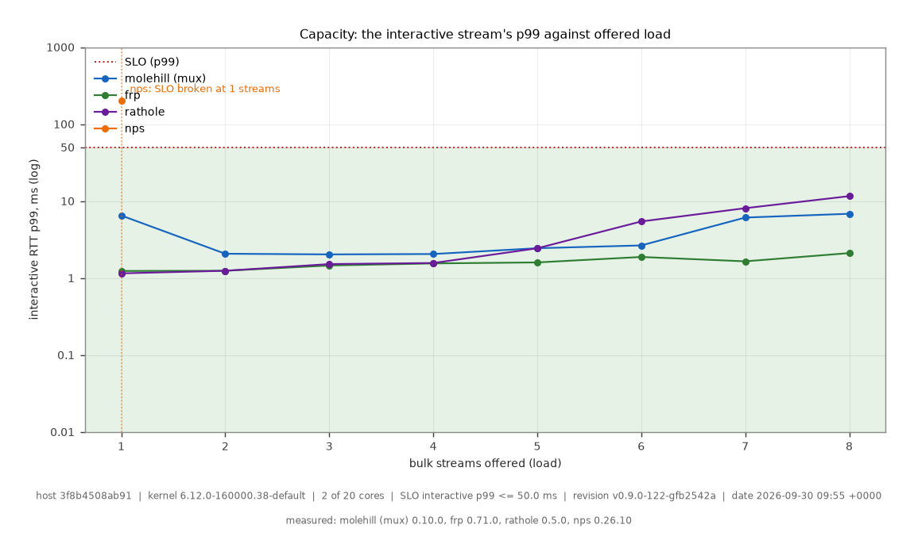

<p align="center">
  
</p>

<h1 align="center">molehill</h1>

<p align="center">
  <a href="LICENSE"></a>
  
  
  
</p>
<p align="center">
  
  
  
</p>

<p align="center">A secure, stable, high-performance reverse proxy for NAT traversal.</p>

[English](README.md) | [简体中文](README.zh.md)

molehill, like [frp](https://github.com/fatedier/frp) and [ngrok](https://github.com/inconshreveable/ngrok), can help to expose the service on the device behind the NAT to the Internet, via a server with a public IP.

<!-- TOC -->

- [molehill](#molehill)
  - [Features](#features)
  - [Benchmarks](#benchmarks)
    - [Choosing a configuration](#choosing-a-configuration)
    - [molehill vs the plain-TCP peers](#molehill-vs-the-plain-tcp-peers)
  - [Quickstart](#quickstart)
  - [Deployment](#deployment)
    - [Binary](#binary)
    - [systemd](#systemd)
    - [Container](#container)
  - [Configuration](#configuration)
  - [Documentation](#documentation)
  - [Development](#development)

<!-- /TOC -->

## Features

- **High Performance** Much higher throughput can be achieved than frp, and more stable when handling a large volume of connections.
- **Low Resource Consumption** Consumes much fewer memory than similar tools. [The binary can be](docs/build-guide.md) **as small as ~500KiB** to fit the constraints of devices, like embedded devices as routers.
- **Client-Authoritative Services** Since v0.7 the server needs no per-service configuration: clients declare what to expose (including the public port) and the server enforces an `allow_ports` whitelist. One shared token authenticates everything.
- **Multiplexing** Every data channel rides as a yamux stream over one of an elastic pool of tunnel connections (up to `[client.data.tcp|kcp].max_tunnels`, default 4) — no per-connection handshakes, dramatically fewer file descriptors, throughput beyond a single TCP flow, and head-of-line isolation (a lost segment stalls only its own tunnel). The pool starts cold and grows on demand, so a client that is idle holds nothing; the optional `default_carrier = "kcp"` (feature `kcp`) moves the data plane onto KCP-over-UDP sessions. The `[client.data]` knobs and the `mode = "direct"` fallback are covered in [Configuration](./docs/configuration.md).
- **Security** A shared token is mandatory and the `allow_ports` whitelist bounds what any client can expose. The optional Noise Protocol encrypts the wire with a single pre-shared X25519 keypair — no PKI, no CA — and, with `resume = true`, proves a reconnect with a MAC instead of repeating the handshake's key exchanges (connection setup 442.7 -> 38.5 us per pair). `plain` forwards unencrypted.
- **Hot Reload** Services can be added or removed dynamically by hot-reloading the configuration file.

## Benchmarks

Single-machine comparison (`visitor -> server -> client -> backend`, all four
hops on one machine). Everything is measured **through the tunnel**: the probes
dial each tool's exposed port, never the backend it forwards to. The peers are
the latest GitHub release builds (frp, rathole upstream, nps, versions recorded
with each run). Every tool is driven through the identical workload while the
network condition follows a scripted stage schedule, changed in place, so a
tool's session is never rebuilt — how it adapts to a degrading and then
recovering path is part of the measurement.

### Choosing a configuration

The defaults — `mode = "multiplex"`, `max_tunnels = 4`, `carrier = "tcp"`,
plain transport — are the right starting point for almost everyone; deviate
only when the tree says so. Three questions decide the rest, and each answer is
one line in `[client.data]` or `[client.services.<name>]`: **encryption** (set
`[client.transport] type = "noise"` and place the keys, see
[Transport](docs/transport.md)); **concurrency** (raise `max_tunnels` — each
tunnel carries ~64 concurrent connections, so `8` ≈ 512 — or spread one
connection over `[server.data] stripe_count` parallel channels); and **the
path** (A/B `carrier = "kcp"` when TCP data tunnels are throttled or you need
latency-first UDP; keep `max_tunnels >= 4` on lossy paths so the pool aggregates
and isolates head-of-line blocking).

Two numbers decide between those options, and they are best measured on your
own path rather than read off a table: the **sustainable load** (how many bulk
streams the tool carries while a fresh interactive connection still meets the
50 ms and 0.5 % errors) and the **cost at the operating point** (CPU-seconds
per carried Gbit/s). How to run that comparison is in
[Benchmarks](docs/benchmarks.md); the settings themselves — including the
step-by-step decision tree — are in
[Configuration](docs/configuration.md#choosing-your-configuration-decision-tree).

### molehill vs the plain-TCP peers

Every tool is driven through the identical workload — one interactive stream
(the SLO instrument), N = 20 bulk TCP streams, 16 short connections per
second and one UDP session — while the path follows the stage schedule
(netem on `lo`, the control plane left unshaped). The chart below is the
v0.10.0 run on one host (the released binary's defaults: `multiplex`, an
elastic pool of up to four tunnels per service, plain transport): the orange
line is the bulk throughput, the blue points the interactive stream's RTT, the
shaded bands the path classes, the dashed line the SLO (p99 <= 50 ms).


The same run as small multiples — one panel per stage, a lollipop per tool
(dot = p50, bar = p99, tick = worst second), so "who wins which condition"
reads without a table:


**Interactive stream RTT p99, per stage** (ms). A shaped stage of a saturated
run carries tens of samples, and a stage under a hundred reports its *worst
observation* rather than a p99 — the sample counts are in the results file
beside these numbers. `~` marks a **shaped** class: the value is the run's
reading, but the harness installed the queue that dominates it and one run does
not repeat it — three runs of one unchanged method moved these cells by 5-24 %
on this host — so the `~` columns are context and no winner is marked in them.
`‡` marks a stage that also recorded a wedge (a silent stretch, drawn as a flat
segment in the chart); a stage that recovered carries both the marker and its
number.

| tool | clean | rtt100 | loss1 | loss5 | rate100 | rate20 | jitter | clean (repeat) |
|---|---|---|---|---|---|---|---|---|
| molehill (mux) | 7.3 | ~7466‡ | ~1131 | ~3104‡ | ~3225 | ~9308‡ | ~5820‡ | 7.3 |
| frp | 2.8 | ~7150‡ | ~1066 | ~5011‡ | ~3195 | ~8722‡ | ~9381‡ | 2.8 |
| rathole | 70.5 | ~8232‡ | ~1136 | ~3890‡ | ~3218 | ~7088‡ | ~5174‡ | 77.3 |
| nps | 67.0 | ~471 | ~1080 | ~3520 | ~3294 | ~9214‡ | ~7437‡ | 67.9 |

**Bulk throughput per stage** (Gbit/s, over the stage's whole measured window,
not its best second: netem releases a shaped burst into whichever interval it
likes, so the peak is the shaper's schedule, not the path). `*` marks a cell
read from the **receiver's** own window — on a rate class the client's socket
buffer absorbs megabytes, the sender's intervals read zero bytes while the path
drains, and the receiver is the only side that can speak for it. `— †` is a
stage with **no reading at all**: the sender's accounting is defeated (90-100 %
zero-byte intervals here) and the dial produced no receiver summary, because
the client was still blocked past the stage boundary. `rate100` reading
0.100 Gbit/s on every arm is the shaper's own number — that cell has no contrast
by construction — and `rate20`/`jitter` carry no reading at all, which is a
limit of the model and not a result about any tool.

| tool | clean | rtt100 | loss1 | loss5 | rate100 | rate20 | jitter | clean (repeat) |
|---|---|---|---|---|---|---|---|---|
| molehill (mux) | 21.783 | 5.224 | 9.703 | 5.266 | 0.100 * | — † | — † | 22.160 |
| frp | 6.057 | 5.566 | 5.657 | 5.276 | 0.100 * | — † | — † | 6.085 |
| rathole | 21.184 | 5.234 | 9.694 | 5.239 | 0.100 * | — † | — † | 21.057 |
| nps | 0.134 | 0.156 | 0.143 | 0.166 | 0.100 * | — † | — † | 0.132 |

**The noise these numbers have to clear.** The schedule measures `clean` at
both ends of every timeline, so each tool's two clean readings are two samples
of one condition about an hour apart — the run's own replicate, and the scale
every other cell has to be read against. `just soak-check` reports it:

| tool | clean bulk reading | clean interactive p99 |
|---|---|---|
| molehill (mux) | 21.783 – 22.160 Gbit/s (**1.7 %** apart) | 7.3 – 7.3 ms |
| frp | 6.057 – 6.085 Gbit/s (**0.5 %** apart) | 2.8 – 2.8 ms |
| rathole | 21.057 – 21.184 Gbit/s (**0.6 %** apart) | 70.5 – 77.3 ms |
| nps | 0.132 – 0.134 Gbit/s (**1.0 %** apart) | 67.0 – 67.9 ms |

**How much it carries.** The same artifact carries the load ramp: the first
bulk load level at which a fresh interactive connection breaks the SLO (p99
50 ms, 0.5 % errors). It is a *different instrument* from the staged schedule —
the schedule asks what happens as the path changes, the ramp asks where the
ceiling is — and neither cross-checks the other.

| tool | sustainable streams | ceiling | headroom | reason at the break |
|---|---|---|---|---|
| molehill (mux) | 8 | 8 | 0.0 | never broke |
| frp | 8 | 8 | 0.0 | never broke |
| rathole | 8 | 8 | 0.0 | never broke |
| nps | 0 | 8 | 1.0 | interactive p99 204.916 > 50.0 |



Three arms carried the ramp's full 8 streams, which is the ramp's own ceiling,
so that reads as a **floor** ("at least 8"), not as a measured maximum; nps
breaks the SLO at the first stream it is offered.

**What these shapes say.** Every tool degrades under a bad path and every tool
recovers on the return to clean — that recovery is what the last column
measures, and a tool that stayed wedged would be a finding. On the clean path
**molehill and rathole are the throughput pair** (21.1-22.2 Gbit/s against
21.1-21.2; the ~3 % gap is inside twice the run's own replicate, so this run
does not separate them) at very different latency: 7.3 ms against 70.5-77.3 ms.
frp carries 3.6x less bulk (6.06) but answers in 2.8 ms, and it is the only arm
inside the SLO on both axes with molehill. nps is 160x behind on clean bulk
(0.13 Gbit/s) and 67 ms on latency. `loss1` (10 ms delay, 1 % loss) separates
the throughput pair from frp: 9.7 Gbit/s for molehill and rathole against 5.7
for frp, with nps at 0.14. On the shaped stages the interactives are *context*:
they are dominated by the queue the harness installed, they swing by more than
any between-tool gap in them between runs of unchanged code, and every arm
wedges on `rate20` and `jitter` — that is the path, not one tool. The honest
losses are carried rather than smoothed over: frp's clean-stage interactive cost
is 2.8 ms against molehill's 7.3, and nps again reads zero bytes on a share of
its intervals in *every* stage including the clean ones, which no other arm does.

The peers are driven by the same workload and charted in the same panels; the
drift axis (open fds, RSS and CPU slopes over the run) is in
`soak-v0.10.0-drift.png`, the UDP session's RTT/loss in
`soak-v0.10.0-udp.png` (a sliding loss *rate*, not a count of loss events), and
the load ramp in `soak-v0.10.0-capacity.png`.

These are v0.10.0 numbers from one host, measured with the method this page
describes. Only runs of the same model, method and host compare directly, and
every results file records the host and the method it used: `just soak-check`
reads both, refuses to gate one host's or one method's run against another's,
and gates each run on its own completeness, endpoint and SLO checks.
The per-stage numbers carry their sample count in the results file
(`rtt_n`): a stage that carried fewer than a hundred interactive samples
reports its *worst observation* as the p99, which is what a shaped stage of a
saturated run (tens of samples) is.
Reading a chart, reproducing a run and the gate's verdict:
[Benchmarks](docs/benchmarks.md). How to read a chart in detail (the log axis, the
step lines, the wedge bars, what each band means), the stage schedule, the test
types and how to reproduce a run on your own hardware:
[Benchmarks](docs/benchmarks.md).

## Quickstart

A full-powered `molehill` can be obtained from the [release](https://github.com/NIyueeE/molehill/releases) page. Or [build from source](docs/build-guide.md) **for other platforms and minimizing the binary**.

Like frp, all service definitions live on the client side; the server only sets policy (a shared token and the `allow_ports` whitelist).

To use `molehill`, you need a server with a public IP, and a device behind the NAT, where some services that need to be exposed to the Internet.

Assuming you have a NAS at home behind the NAT, and want to expose its ssh service to the Internet:

1. On the server which has a public IP

Create `server.toml` with the following content and accommodate it to your needs.

```toml
# server.toml
[server]
default_token = "use_a_secret_that_only_you_know" # Shared secret with your clients # security-scan:allow documentation placeholder

# Master switch for dynamic registrations: only ports covered here can be claimed by clients
allow_ports = ["5202"]

[server.control]
bind_addr = "0.0.0.0:2333" # Port that molehill listens for clients
```

Then run:

```bash
./molehill server.toml
```

2. On the host which is behind the NAT (your NAS)

Create `client.toml` with the following content and accommodate it to your needs.

```toml
# client.toml
[client]
default_token = "use_a_secret_that_only_you_know" # Must match the server's `default_token` # security-scan:allow documentation placeholder

[client.control]
default_remote_addr = "myserver.com:2333" # The address of the server. The port must match `server.control.bind_addr`

[client.services.my_nas_ssh]
local_addr = "127.0.0.1:22" # The local service to forward
remote_bind_addr = "0.0.0.0:5202" # The public port to expose it at on the server
```

At startup the client registers `my_nas_ssh` on the server, which validates
the port against `allow_ports` and starts forwarding. Adding or removing
services in `client.toml` applies live via hot reload — no server-side edit
needed.

Then run:

```bash
./molehill client.toml
```

3. Now the client will try to connect to the server `myserver.com` on port `2333`, and any traffic to `myserver.com:5202` will be forwarded to the client's port `22`.

So you can `ssh -p 5202 myserver.com` to ssh to your NAS.

To run `molehill` as a background service on Linux, checkout the
[systemd units](./docs/configuration.md#systemd) or the
[container deployments](./docs/configuration.md#container).

## Configuration

`molehill` determines the running mode (server/client) from the config file
automatically, or you can force it with `--server` / `--client`. The full
configuration specification, logging and tuning options are documented in
[Configuration](./docs/configuration.md), which also includes
[complete examples](./docs/configuration.md#complete-examples) for various
scenarios.

## Deployment

Download a pre-built binary for your platform from the
[release page](https://github.com/NIyueeE/molehill/releases), or
[build from source](./docs/build-guide.md) for other platforms and
minimal-sized binaries.

```bash
./molehill server.toml   # on the public server
./molehill client.toml   # on the device behind NAT
```

How to run it as a service is in [Configuration](./docs/configuration.md),
which owns the [systemd units](./docs/configuration.md#systemd) (root and
rootless, multiple instances) and the
[container deployments](./docs/configuration.md#container) — the published
`ghcr.io/niyueee/molehill` images (linux/amd64, linux/arm64; a static musl
binary on `scratch`), the non-root UID they run as, and the one
container-specific note that a `carrier = "kcp"` service needs its data-plane
port published over **UDP**.

## Documentation

For people running molehill:

- [Configuration](./docs/configuration.md) — full configuration specification, logging, tuning
- [Transport](./docs/transport.md) — Noise Protocol setup
- [Benchmarks](./docs/benchmarks.md) — how the published numbers are produced, how to read them, how to reproduce them
- [Build guide](./docs/build-guide.md) — build customization, minimal binary
- [Internals](./docs/internals.md) — how control/data channels work
- [Configuration examples](./docs/configuration.md#complete-examples) — configs for common scenarios (systemd & container deployments included)

For people changing it (contributor and governance docs are English-only by
decision — see [AGENTS.md](./AGENTS.md) §3):

- [Checks](./docs/checks.md) — what every gate runs, how to handle a block
- [Lint policy](./docs/lint-policy.md) — lint levels and waiver rules
- [Release](./docs/release.md) — release mechanics, versioning, test builds
- [Structure](./docs/structure.md) — what every file in this repo is for
- [Contributing](./CONTRIBUTING.md) — setup and workflow
- [Security](./SECURITY.md) — reporting vulnerabilities
- [`HANDOFF.md`](./HANDOFF.md) — current working state; planned work and future design documents

## Development

molehill is written in Rust (2024 edition); `rust-toolchain.toml` declares
`channel = "stable"` with clippy and rustfmt components — never hardcode a
version. Layered git hooks guard every commit, push, and release tag, and CI
runs the identical chain for anything that touches code — a docs-only change
runs just the docs-alignment check (`docs.yml`) instead:

```bash
just setup   # activate git hooks (core.hooksPath githooks) + install check tools
just check   # fmt / secrets / machete / docs / ruff (check + format) / clippy + audit / deny / outdated / test
just tag     # release review (githooks/pre-tag) + create the local v* tag
```

molehill began as a fork of [rathole](https://github.com/rapiz1/rathole)
(Apache-2.0) and has been developed independently since; the upstream
history is preserved below the fork point and the version line continues
from there (upstream's last release was v0.5.0). See
[docs/release.md](./docs/release.md) for release mechanics and
[AGENTS.md](./AGENTS.md) for the repository rules.
