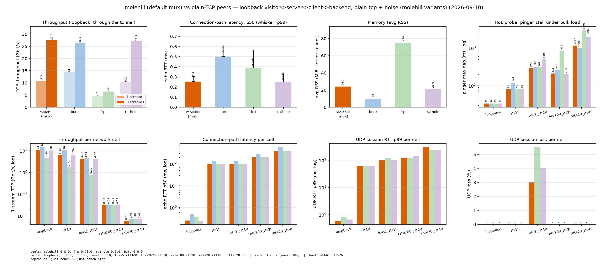
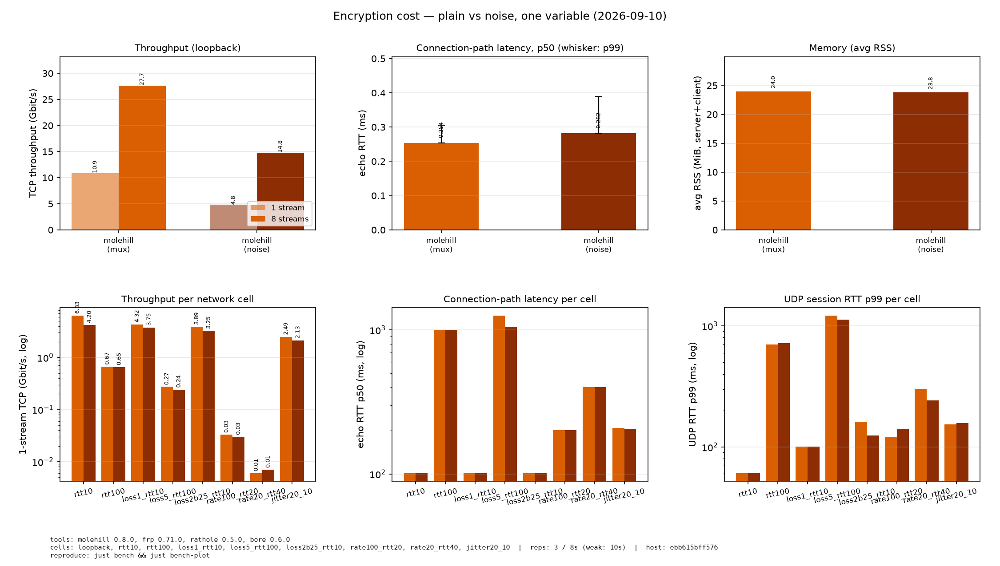
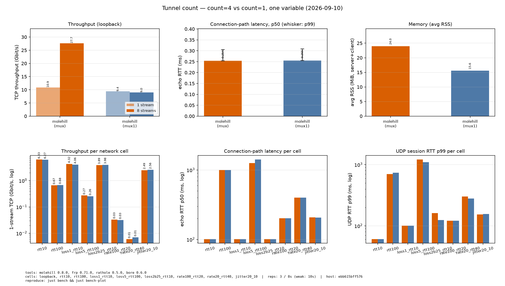
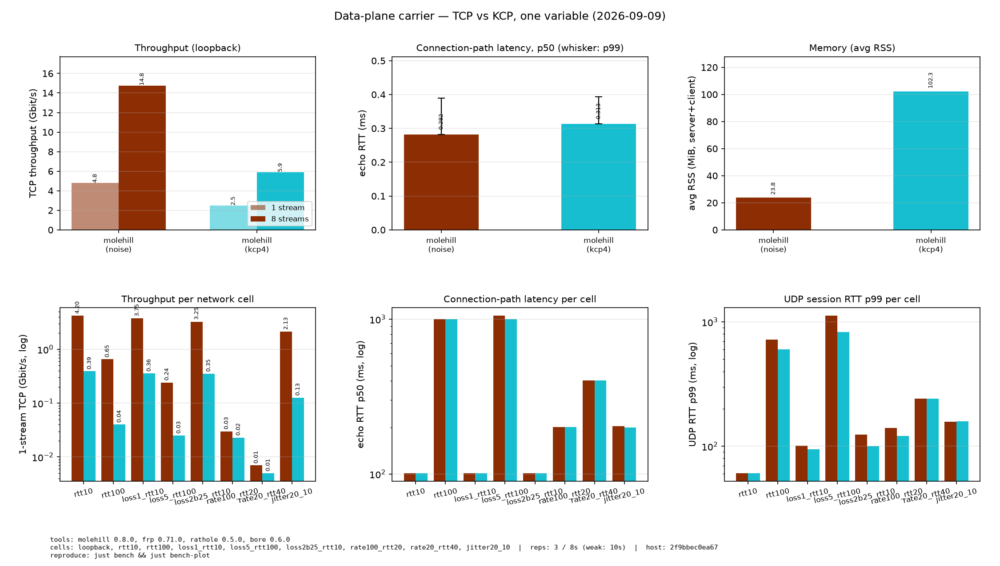
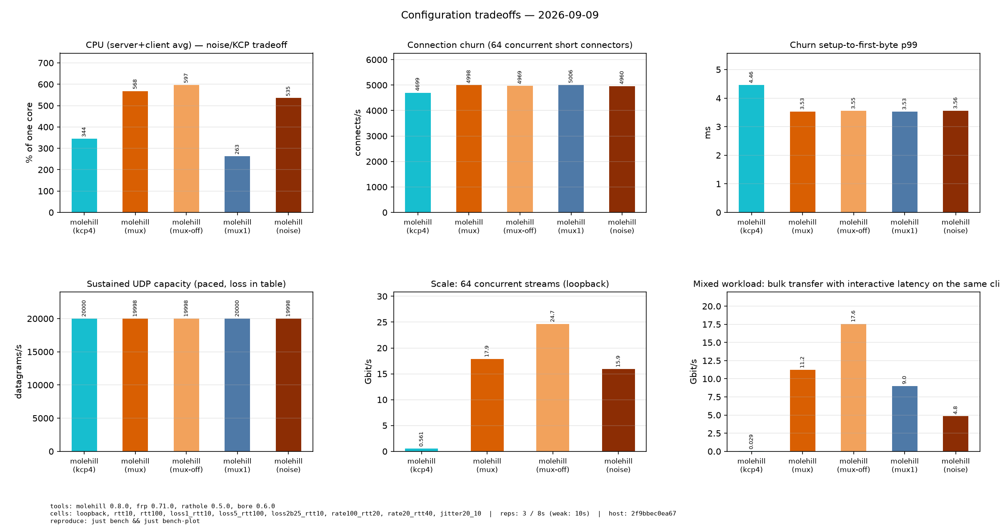

<p align="center">
  
</p>

<h1 align="center">molehill</h1>

<p align="center">
  <a href="LICENSE"></a>
  
  
  
</p>
<p align="center">
  
  
  
</p>

<p align="center">面向 NAT 穿透的安全、稳定、高性能反向代理。</p>

[English](README.md) | [简体中文](README.zh.md)

molehill，类似于 [frp](https://github.com/fatedier/frp) 和 [ngrok](https://github.com/inconshreveable/ngrok)，可以将 NAT 后的设备上的服务通过具有公网 IP 的服务器暴露到互联网。

<!-- TOC -->

- [molehill](#molehill)
  - [特性](#特性)
  - [快速开始](#快速开始)
  - [部署](#部署)
    - [二进制](#二进制)
    - [systemd](#systemd)
    - [容器](#容器)
  - [配置](#配置)
  - [文档](#文档)
  - [开发](#开发)

<!-- /TOC -->

## 特性

- **高性能** 具有更高的吞吐量，高并发下更稳定。
- **低资源消耗** 内存占用远低于同类工具。[二进制文件最小](docs/build-guide.md)可以到 **~500KiB**，可以部署在嵌入式设备如路由器上。
- **客户端声明服务** 从 v0.7 起，服务端不再需要逐服务配置：客户端声明要暴露的内容（包括公网端口），服务端只通过 `allow_ports` 白名单和共享 `default_token` 执行策略。
- **多路复用** 默认情况下，每个数据通道都作为 yamux 流跑在 N 条并行隧道中的一条上（`[client.data].default_count = 4`）——省去每条连接的握手、显著减少文件描述符，吞吐超越单条 TCP 流并隔离队头阻塞（丢段只停滞自己的隧道）。可选的 `default_carrier = "kcp"`（feature `kcp`）把数据面换成 KCP-over-UDP 会话。`[client.data]` 默认选项与 `mode = "direct"` 回退路径见[配置文档](./docs/configuration.zh.md)。
- **安全性** 共享 token 强制鉴权，`allow_ports` 白名单限制客户端可暴露的端口。可选的 Noise Protocol 只需一对预共享 X25519 密钥即可加密传输——没有 PKI、没有 CA。`plain` 为明文转发。
- **热重载** 支持配置文件热重载，动态添加或移除端口转发服务。

## 基准测试

单机对比(全部走回环,`访客 → 服务端 → 客户端 → 后端`);一切**穿过
隧道**测量——iperf3 与探针拨的是每个工具的暴露端口,绝不直接连后端。
对端工具为最新 GitHub release 构建(frp 0.71.0、rathole 0.5.0 上游、
bore 0.6.0)。网络档(netem 塑造整个 `lo`,每一跳都被延迟/丢包)与指标
集合见[方法论](#方法论)。以下是 **v0.8.0** 数字(v0.7.2 基线跑的是单隧道
默认配置且在不同容器上;跨版本数值仅供参考——同矩阵内对比才是精确的)。

### 如何选配置

下面的测量为默认值背书,并告诉你在何时偏离:

| 配置 | 何时使用 | 实测代价 |
|---|---|---|
| **`mode = "multiplex"`(默认)** | 一个客户端暴露**多个服务**,或连接高频开合(HTTP/游戏会话);连接资源重要(FD、端口、**NAT 映射**——NAT 后每条物理隧道占一个映射) | 单流上限 ~10.9 Gbit/s(`direct` 为 19.3);yamux 上限把并发连接钉在 `count × 32`(默认 `count = 4` 即 128——64 可用,128 开始失败);某服务的 UDP 洪泛可能饿死同客户端的 TCP(共享一个发送队列) |
| **`mode = "direct"`** | 单个服务或少数长连接(SSH);**原始吞吐优先**(大流量传输):回环 19.3/28.0 Gbit/s | 每条流一条物理隧道:FD/端口/NAT 映射随流数增长;每连接建连成本真实存在(churn p99 ~3.5 ms,16 路并发)但在 `pool_size = 8` 下不可见 |
| **`count = 4`(默认)** | 并发流多,或链路有损:独立隧道隔离队头阻塞、聚合超过单流 | 每服务 4 条物理连接(FD/端口/NAT 映射);1% 丢包下 8 流 15.4 vs `count = 1` 的 4.6 Gbit/s;重损时共享重传域显现(loss5 HoL 最大 1673 vs `count = 1` 的 1157 ms) |
| **`count = 1`** | 单条长连接,或连接预算紧张 | 单 TCP 流天花板;所有流共享一个重传域 |
| **`carrier = "kcp"`**(实验性) | 仅当 TCP 数据隧道被封锁/限速时;KCP 用 CPU 和内存换激进的丢包恢复 | 每个格子里吞吐都远低于 `carrier = "tcp"`(回环 1 流 2.5 vs 对照 noise 的 4.8 Gbit/s;抖动格子 0.127 vs 2.1),RSS 约 4 倍(102 vs 24 MiB);唯一亮点:rtt100 下它的 UDP 会话质量保持(丢包 0%、最大包间隔 20 ms,而 TCP 各 arm 的"游戏"卡顿 100+ ms) |
| **noise** | 要加密且**内存与简单性优先**:预共享公钥、无 PKI,23.8 MiB | 回环吞吐 4.8/14.8 vs 明文的 10.9/27.7 Gbit/s(1/8 流);RTT 代价亚毫秒;满载时 CPU 与明文持平(均 ~550% 单核——ring 加速的加密成本被转发路径淹没) |

如何应用:全局默认在 `[client.data]`,每个服务可在自己的
`[client.services.<name>]` 上单独覆盖 `mode`/`count`/`carrier`——同一
客户端可以混跑 mux 交互服务与 `direct` 大流量服务,还能用 `remote_addr`
把个别服务指向不同的 molehill 服务端(服务端按连接自适应,无需改配置)。
`[transport]` 见[配置](docs/configuration.md);noise 密钥见
[传输](docs/transport.md);可运行的配置见[快速开始](#快速开始)与
[完整示例](./docs/configuration.zh.md#完整示例)。

**怎么选:分步走。** 从默认值(`multiplex`、`count = 4`、
`carrier = "tcp"`、明文)出发,回答三个关于你负载的问题;一次只改一项,
改完复测:

1. **需要加密吗?** 需要 → `[client.transport] type = "noise"` 并放置密钥
   (代价:单流吞吐约 -55%,需求低于 ~2 Gbit/s 时无感;RTT 亚毫秒)。不需要
   → 保持 `"plain"`。
2. **单人还是多人?并发连接多少?** 单条长连接(SSH、单玩家 Minecraft)→
   `direct` 或默认 mux 都行;低并发下 mux 还省 NAT 映射。多人/高频开合/
   多服务 → 保持或加大 `count`(每条隧道约承载 32 条并发连接,yamux
   上限——`count = 8` ≈ 256)。
3. **路径什么状况?** 纯高延迟(100ms+ RTT,如跨洲)→ 保持默认;只有
   **UDP** 交互服务(游戏)在这种路径上才值得 A/B 试 `carrier = "kcp"`
   ——这是数据显示它唯一稳赢的区间(会话最大间隔 20 ms vs 100+ ms)。
   有损/wifi 路径 → KCP 无实测收益;`count >= 4` 才是你要的聚合与
   丢包隔离。

用你关心的口径验证:延迟用 `ping`/游戏手感,原始吞吐用暴露端口的
`iperf3`,真实流量看暴露服务的行为。开发期 `just bench-fast` 提供约
2 分钟的 molehill-only 矩阵,便于在本机 A/B 配置。

### molehill vs 明文 TCP 对端

仅明文轴(mux 开启、不加密):加密类竞品(如 chisel 的 SSH 隧道)在明文
轴上不可比——molehill 自己的加密行单独隔离在下方。



| 工具 | 1 流 | 8 流 | echo RTT p50 | 内存 |
|---|---|---|---|---|
| **molehill (mux)** | 10.9 | 27.7 | 0.254 ms | 24.0 MiB |
| rathole 0.5.0 | 10.2 | 27.3 | 0.249 ms | 21.0 MiB |
| bore 0.6.0 | 14.3 | 26.5 | 0.500 ms | **9.8 MiB** |
| frp 0.71.0 | 4.6 | 6.4 | 0.388 ms | 75.3 MiB |

在默认 `count = 4` 下,复用客户端在 8 流时追平每连接架构(27.7 vs
26.5-27.3 Gbit/s);bore 仍然最轻、是强力的明文 TCP 中继(不支持 UDP
转发);frp 用最高内存换最低吞吐。10 ms 格子上所有工具都贴着 ~101 ms
echo RTT(bore 每次连接多付几个往返——142 ms),仅 molehill 的 100 ms
格子保持 ~1001 ms(见 count 图);1% 丢包下 molehill、rathole 与 bore
守住 4.2-4.4 Gbit/s,frp 塌到 0.8。在限速瓶颈格子(rate100/rate20)上所有隧道收敛到
同样的 ~1/3 标称速率吞吐(0.033 / 0.007 Gbit/s——netem 在回环上只
交付标称速率约三分之一),所以这两个格子讲的是相对开销的故事,不是
工具排名。

### molehill:复用成本(mux vs mux-off)

单变量(复用开关),回环:


| 格子 | mux 1 流 | mux-off 1 流 | mux 8 流 | mux-off 8 流 |
|---|---|---|---|---|
| loopback | 10.9 | 19.3 | 27.7 | 28.0 |

单流可见 mux 开销(10.9 vs 19.3 Gbit/s);8 流时默认 4 条隧道聚合到与
每连接架构相同的天花板。复用真正的代价在丢包与并发下显现——见下面的
隧道数轴(mux-off 按设计只跑回环格子)。

### molehill:传输成本(mux vs noise)

单变量(加密),两者都开 mux:



| 配置 | 1 流 | 8 流 | echo RTT p50 | 内存 |
|---|---|---|---|---|
| **mux(明文)** | 10.9 | 27.7 | 0.254 ms | 24.0 MiB |
| noise | 4.8 | 14.8 | 0.282 ms | 23.8 MiB |

noise 单流吞吐约为明文的 ~44%(4.8 vs 10.9 Gbit/s)、8 流约 ~53%
(14.8 vs 27.7),RTT 代价亚毫秒、内存不变。弱格子里加密行跟随明文行。

### molehill:隧道数(`count = 4` vs `count = 1`)

单变量(并行隧道连接数),明文传输,其余全默认:



| 格子 | c4 1 流 | c1 1 流 | c4 8 流 | c1 8 流 | c4 HoL 最大 | c1 HoL 最大 |
|---|---|---|---|---|---|---|
| loopback | 10.9 | 9.4 | 27.7 | 9.0 | 33.4 | 33.4 |
| rtt10 | 6.3 | 6.3 | 7.8 | 5.7 | 80.6 | 101.4 |
| rtt100 | 0.668 | 0.684 | 1.1 | 0.93 | 801.4 | 1001.7 |
| 丢包 1% | 4.3 | 4.1 | 15.4 | 4.6 | 289.6 | 314.4 |
| 丢包 5% | 0.273 | 0.256 | 0.734 | 0.295 | 1673.0 | 1157.4 |
| 丢包 2% 突发 | 3.9 | 4.0 | 14.5 | 4.5 | 349.4 | 288.5 |
| rate100_rtt20 | 0.033 | 0.032 | 0.032 | 0.031 | 210.6 | 689.9 |
| rate20_rtt40 | 0.006 | 0.007 | - | - | 1167.3 | 1311.7 |
| jitter20_10 | 2.5 | 2.6 | 4.6 | 4.2 | 159.1 | 160.2 |

独立隧道把并发流聚合越过单流(丢包 1% 8 流 15.4 vs 4.6 Gbit/s),默认
`count = 4` 时 yamux 上限允许约 128 条并发连接(每隧道 `count × 32`)。
重损下的代价:4 条隧道上的所有流共享重传域(loss5 HoL 最大 1673 vs
`count = 1` 的 1157 ms)。rate20 格子只报 1 流——8 条并行 iperf 流会把
单测试的 iperf3 服务器楔死在塑形路径上(见方法论);rate100 两种都测。

### molehill:数据面载体(`carrier = "tcp"` vs `"kcp"`)

单变量(数据通道由什么承载),noise 控制通道,两者 `count = 4`:



| 格子 | tcp 1 流 | kcp 1 流 | tcp 8 流 | kcp 8 流 | tcp HoL 最大 | kcp HoL 最大 | tcp RSS | kcp RSS |
|---|---|---|---|---|---|---|---|---|
| loopback | 4.8 | 2.5 | 14.8 | 5.9 | 33.4 | 33.4 | 23.8 | 102.3 |
| rtt10 | 4.2 | 0.391 | 5.5 | 0.39 | 81.1 | 81.1 | 20.6 | 121.1 |
| rtt100 | 0.652 | 0.04 | 0.992 | 0.051 | 801.6 | 801.3 | 19.3 | 84.4 |
| 丢包 1% | 3.7 | 0.356 | 8.6 | 0.413 | 360.0 | 327.5 | 28.5 | 111.4 |
| 丢包 5% | 0.242 | 0.025 | 0.62 | 0.045 | 2963.2 | 1444.0 | 21.6 | 80.8 |
| 丢包 2% 突发 | 3.3 | 0.353 | 9.5 | 0.382 | 1179.7 | 523.2 | 34.3 | 108.6 |
| rate100_rtt20 | 0.03 | 0.023 | 0.03 | 0 | 514.2 | 377.8 | 18.1 | 49.4 |
| rate20_rtt40 | 0.007 | 0.005 | - | - | 2039.8 | 2252.5 | 19.9 | 27.7 |
| jitter20_10 | 2.1 | 0.127 | 3.1 | 0.114 | 159.3 | 377.3 | 21.6 | 106.1 |

KCP-over-UDP 在每个格子里都明显慢于 TCP 隧道,内存约 4 倍(2048/4096
ARQ 窗口的代价);唯一实测优势是高延迟下的 UDP 会话质量:rtt100 下探针
显示 0% 丢包、最大包间隔 20 ms,而 TCP 各 arm 的游戏会话卡 100+ ms。
仅在 TCP 数据隧道被封锁或限速时值得考虑。

### 配置权衡(回环)



| 工具 | CPU% | churn/秒 | churn p99 ms | UDP pps | 64 流 | 混合大流 |
|---|---|---|---|---|---|---|
| **mux** | 568.3 | 4998.0 | 3.53 | 19997.8 | 17.87 | 11.22 |
| mux-off | 596.6 | 4969.3 | 3.55 | 19997.8 | 24.65 | 17.56 |
| noise | 535.3 | 4960.0 | 3.56 | 19997.8 | 15.93 | 4.84 |
| mux1 | 262.6 | 5005.7 | 3.53 | 19999.6 | - | 9.00 |
| kcp4 | 344.2 | 4698.7 | 4.46 | 19999.7 | 0.56 | 0.03 |

所有模式都能扛 ~2 万 UDP 数据报/秒、0% 丢包,churn 下 ~5 千连接/秒
(建连到首字节 p99 ~3.5-4.7 ms——连接池吸收了建连成本);noise 满载 CPU 与
明文持平,KCP 的 CPU% 较低只是因为它的吞吐更低。`mux1` 不出现在 64 流
面板里:单隧道承载 64 流超过 yamux 上限 `count × 32`(此处为
32),运行器按设计跳过该规模点,而不是把 iperf3 服务器楔死;其后的混合
负载探针因此测得 9.0 Gbit/s(此前它继承了楔死状态,只能记为 null)。
混合负载展示了按服务的故事:同客户端上大流量服务会饿死交互服务
(mux 混合大流 11.2 vs direct 的 17.6 Gbit/s)。

### 方法论

- **环境**:单机回环;四跳(访客、服务端、客户端、后端)都是同一台
  机器上的进程,所以绝对数值与主机相关——只做同机同方法学的对比。
- **网络档**:loopback、rtt10、rtt100、丢包 1%、丢包 5%、丢包 2% 突发,
  以及限速档(r100/20、r20/40——瓶颈上行)与抖动档(j20/10);netem
  塑造整个 `lo`,每一跳都被延迟/丢包;"10 ms"档的 echo RTT 约 100 ms
  是因为路径多段。无 `CAP_NET_ADMIN` 时,rtt 档退化为用户态延迟代理、
  丢包档自动跳过。限速档在回环上只达到名义速率的约 30%——把它们当
  相对开销对比读,不是字面链路速度。明文 TCP 对端只跑精简子集
  (loopback、rtt10、丢包 1% 与两个限速档);因此"molehill vs 对端"图
  只画这些格子,纯延迟、丢包 5%、突发丢包与抖动档属于 molehill-only
  的故事,由 count 与 carrier 图呈现。
- **指标**:TCP 吞吐(1/8/64 流——64 是 yamux 上限 `count × 32` 并发
  连接之下的安全工作点;中位数 rep 及其重传数,外加跨 reps 的
  min/max 离散度)、连接路径 RTT(新连接,最多 300 次采样、20 s 墙钟
  上限)、稳态数据路径 RTT(单连接 ping,同样 20 s 上限)、**连接
  churn**(短连接风暴:16 路并发下的连接/秒与建立到首字节 p50/p99——
  mux-vs-direct 与 pool 指导数据)、UDP 会话质量(单会话 RTT/丢包/
  抖动/最大间隔)与**持续 UDP 容量**(20k 数据报/秒限速,投递 pps +
  丢包)、队头阻塞探针(同服务饱和打流 + 游戏式 pinger)、**混合负载**
  (同一客户端的两个服务上同时跑 iperf 大流与交互延迟——按服务覆盖
  指导)、**CPU%**(server+client 的噪声/KCP 交易成本)与 RSS(0.5 s
  采样)。
- **严谨性**:每次对比只变**一个变量**(明文轴线、复用开关、传输层),
  共享对照组;arm 在隔离端口带上**串行**执行、每次全新进程(并行会
  争抢 CPU,使数字失效);molehill 3 次重复、peers 1 次;矩阵自带节流
  (nice 10,且每个 arm 开始前等待负载均值降到核数 70% 以下),保证每个
  arm 从安静机器开始,长跑也不会冻结主机。
- **已知限制**:回环不是真实网络(丢包/时延理想化,无真实拥塞);共享
  qdisc 会稀释丢包——UDP 丢包列是轻会话看到的残余份额,不是配置值;
  `pool_size=8` 连接池掩盖了建连握手成本(churn 指标现在显示了残余
  成本);连接资源指标(FD、NAT 映射、TIME_WAIT)——mux 的主要收益——
  未测量;限速档需要支持 `rate` 的 netem(新版本 iproute2)。
  在低速率 rate20 格子上,8 条并行 iperf3 流会把单测试的 iperf3 服务器
  楔死(netem 的包数上限按 GSO 大段计数,塑形路径上的缓冲达数秒)——其
  8 流位置为 `null`,原因记录在 `partial_metrics` 中;rate100 格子
  1 流和 8 流都能测。yamux 上限(`count × 32`)低于 64 流规模点的
  arm 同样跳过该探针。图只画真正参与比较的行与格子(对端没跑的格子、
  结构性跳过的探针都不占位);比较面板内缺失的值画成灰色 `x`,实测为 0
  则标注 `0`,让"零"和"缺失"保持可区分。HoL pinger 若只收到 0 或 1 个
  回包,记录为停滞时长(等待时间),而不是 `null`。
- **复现**:`just bench-peers` → `just bench` → `just bench-plot` →
  `just bench-check`(原始数据在 `benches/scripts/bench/results-v0.8.0.json`;
  仪式与回归门禁见 docs/release.md)。

## 快速开始

一个全功能的 `molehill` 可以从 [release](https://github.com/NIyueeE/molehill/releases) 页面下载。或者 [从源码编译](docs/build-guide.md) **获取其他平台和最小化的二进制文件**。

`molehill` 的使用和 frp 非常类似：转发服务由客户端声明，服务端只配置共享 token 和端口策略。

使用 molehill 需要一个有公网 IP 的服务器，和一个在 NAT 或防火墙后的设备，其中有些服务需要暴露在互联网上。

假设你在家里的 NAT 后面有一个 NAS，并且想把它的 ssh 服务暴露在公网上：

1. 在有一个公网 IP 的服务器上

创建 `server.toml`，内容如下，并根据你的需要调整。

```toml
# server.toml
[server]
default_token = "use_a_secret_that_only_you_know" # 与客户端共享的密钥 # security-scan:allow documentation placeholder

# 动态注册的总开关：只有这里覆盖的端口才能被客户端占用
allow_ports = ["5202"]

[server.control]
bind_addr = "0.0.0.0:2333" # molehill 监听客户端连接的端口
```

然后运行:

```bash
./molehill server.toml
```

2. 在 NAT 后面的主机上（你的 NAS）

创建 `client.toml`，内容如下，并根据你的需要调整。

```toml
# client.toml
[client]
default_token = "use_a_secret_that_only_you_know" # 必须和服务端的 `default_token` 一致 # security-scan:allow documentation placeholder

[client.control]
default_remote_addr = "myserver.com:2333" # 服务器的地址，端口必须和 `server.control.bind_addr` 中的端口一致

[client.services.my_nas_ssh]
local_addr = "127.0.0.1:22" # 需要被转发的服务地址
remote_bind_addr = "0.0.0.0:5202" # 在服务端暴露的公网地址
```

然后运行:

```bash
./molehill client.toml
```

启动时客户端会在服务端注册 `my_nas_ssh`，服务端按 `allow_ports` 校验端口并开始转发。在 `client.toml` 中增删服务会通过热重载即时生效——无需改动服务端配置。

3. 现在客户端会尝试连接服务器的 `myserver.com:2333`，任何访问 `myserver.com:5202` 的流量都会被转发到客户端的 `22` 端口。

这样你就可以通过 `ssh -p 5202 myserver.com` 来 ssh 到你的 NAS。

如果想在 Linux 上把 `molehill` 作为后台服务运行，可以参考
[systemd 单元](./docs/configuration.zh.md#systemd) 或
[容器部署](./docs/configuration.zh.md#容器)。

## 配置

`molehill` 会根据配置文件自动判断运行模式（server/client），也可以通过 `--server` / `--client` 强制指定。完整的配置规范、日志和调优选项见
[配置文档](./docs/configuration.zh.md),其中也包含覆盖各种常见场景的
[完整示例](./docs/configuration.zh.md#完整示例)。

## 部署

### 二进制

从 [release 页面](https://github.com/NIyueeE/molehill/releases) 下载对应平台的预编译二进制，或者
[从源码编译](./docs/build-guide.md) 获取其他平台和最小化的二进制。

```bash
./molehill server.toml   # 在公网服务器上
./molehill client.toml   # 在 NAT 后的设备上
```

### systemd

[systemd 单元](./docs/configuration.zh.md#systemd) 演示了如何把 molehill 作为 systemd 服务运行，包含 root 和 rootless 两种方式，以及多实例管理。

### 容器

官方多架构镜像（linux/amd64、linux/arm64）发布在
`ghcr.io/niyueee/molehill`。镜像是构建在 `scratch` 上的单个静态 musl 二进制（约 8 MiB），以非 root UID 1000 运行，并且与常规发布构建使用相同的默认特性集（包含多路复用）。

```bash
docker run -v /etc/molehill/server.toml:/app/server.toml:ro \
  ghcr.io/niyueee/molehill:latest server.toml
```

镜像内不包含任何配置——挂载你的配置文件，并把文件名作为参数传入。更多部署方式见
[容器部署](./docs/configuration.zh.md#容器)，包括 Docker Compose（`compose.yaml` / `compose.bridge.yaml`）和 Podman
Quadlet（`molehill-server.container` / `molehill-client.container`）。

## 文档

使用 molehill：

- [配置文档](./docs/configuration.zh.md) — 完整的配置规范、日志和调优
- [传输层](./docs/transport.zh.md) — Noise Protocol 配置
- [构建指南](./docs/build-guide.md) — 构建定制、最小化二进制
- [内部原理](./docs/internals.md) — 控制通道和数据通道的工作原理
- [配置示例](./docs/configuration.zh.md#完整示例) — 常见场景的配置(含 systemd 与容器部署)

贡献与工程：

- [检查门](./docs/checks.md) — 每个门运行什么、被拦住时怎么办
- [Lint 策略](./docs/lint-policy.md) — lint 级别与豁免规则
- [发布流程](./docs/release.md) — 发布机制、版本编号、测试构建
- [仓库结构](./docs/structure.md) — 仓库里每个文件的用途
- [贡献指南](./CONTRIBUTING.md) — 环境搭建与工作流
- [安全策略](./SECURITY.md) — 漏洞报告
- [`HANDOFF.md`](./HANDOFF.md) — 当前工作状态；计划中的工作和将来的设计文档

## 开发

molehill 使用 Rust 编写（2024 edition）；`rust-toolchain.toml` 声明
`channel = "stable"` 并附带 clippy 与 rustfmt 组件 —— 不要硬编码版本号。分层
git hooks 守护每次 commit、push 与发布 tag，CI 运行同一条链：

```bash
just setup   # 激活 git hooks（core.hooksPath githooks）并安装检查工具
just check   # fmt / secrets / machete / docs / clippy + audit / deny / outdated / test
just tag     # 发布审查（githooks/pre-tag）+ 创建本地 v* tag
```

molehill 起源于 [rathole](https://github.com/rapiz1/rathole) 的 fork
（Apache-2.0），此后独立发展；上游历史完整保留在 fork 点之下，版本号也从
该点续计（上游最后一个版本是 v0.5.0）。发布机制见
[docs/release.md](./docs/release.md)，仓库规则见
[AGENTS.md](./AGENTS.md)。
