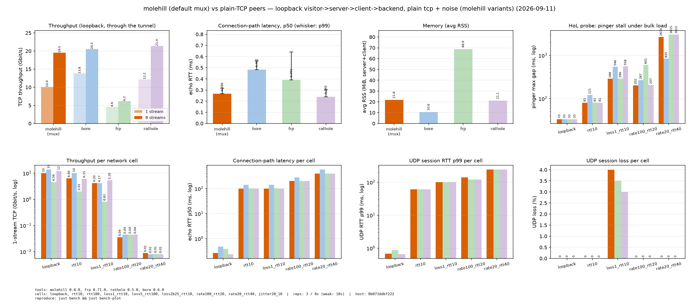
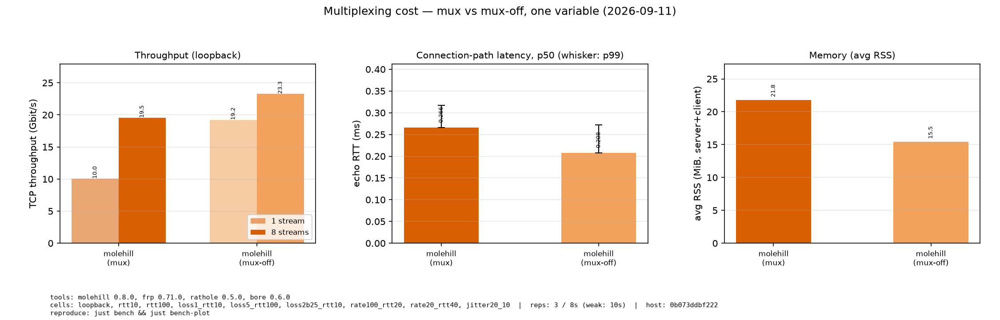
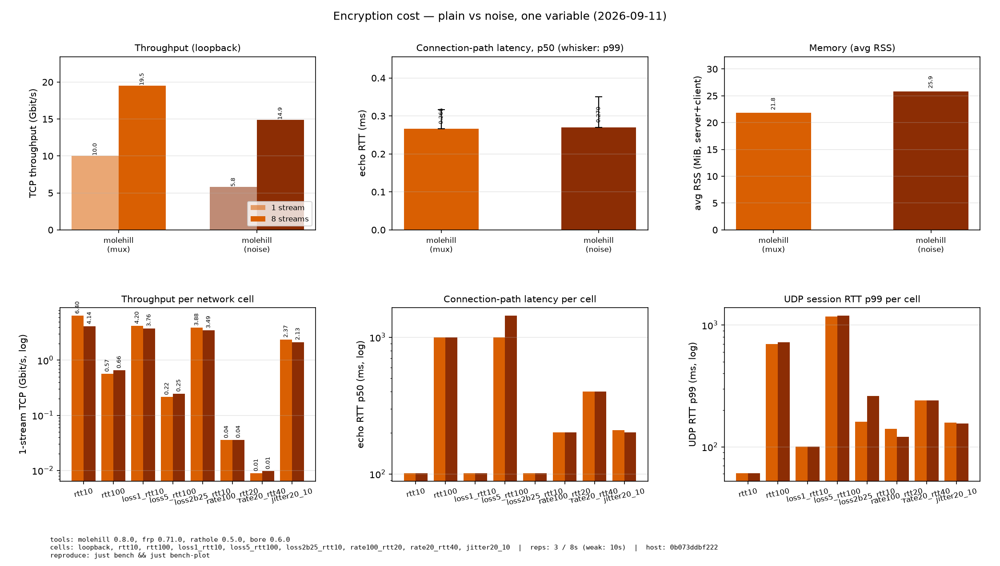
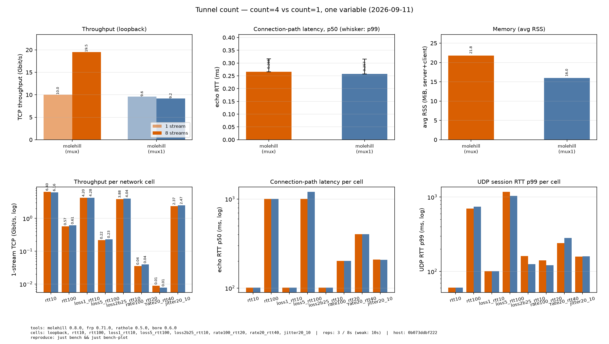
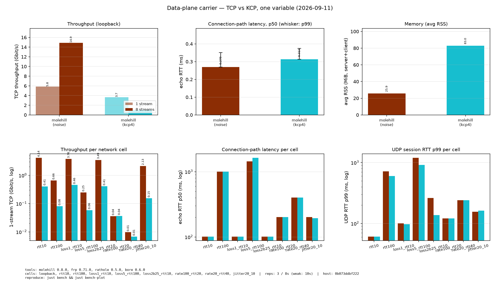
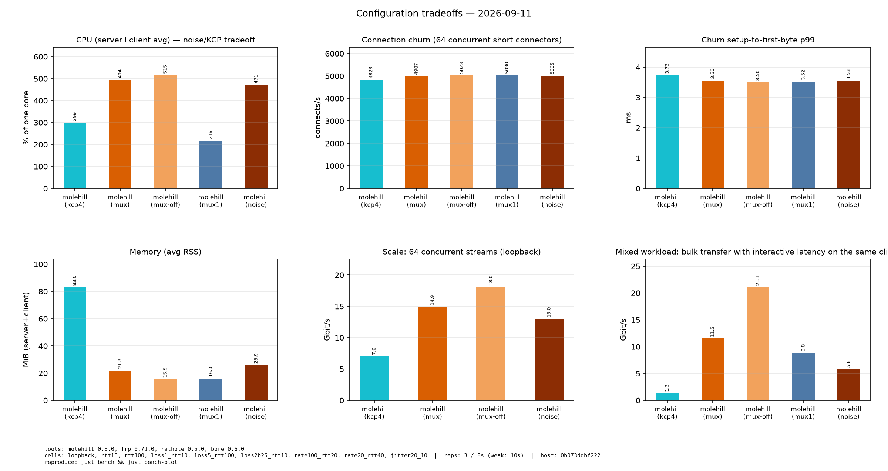

<p align="center">
  
</p>

<h1 align="center">molehill</h1>

<p align="center">
  <a href="LICENSE"></a>
  
  
  
</p>
<p align="center">
  
  
  
</p>

<p align="center">面向 NAT 穿透的安全、稳定、高性能反向代理。</p>

[English](README.md) | [简体中文](README.zh.md)

molehill，类似于 [frp](https://github.com/fatedier/frp) 和 [ngrok](https://github.com/inconshreveable/ngrok)，可以将 NAT 后的设备上的服务通过具有公网 IP 的服务器暴露到互联网。

<!-- TOC -->

- [molehill](#molehill)
  - [特性](#特性)
  - [快速开始](#快速开始)
  - [部署](#部署)
    - [二进制](#二进制)
    - [systemd](#systemd)
    - [容器](#容器)
  - [配置](#配置)
  - [文档](#文档)
  - [开发](#开发)

<!-- /TOC -->

## 特性

- **高性能** 具有更高的吞吐量，高并发下更稳定。
- **低资源消耗** 内存占用远低于同类工具。[二进制文件最小](docs/build-guide.md)可以到 **~500KiB**，可以部署在嵌入式设备如路由器上。
- **客户端声明服务** 从 v0.7 起，服务端不再需要逐服务配置：客户端声明要暴露的内容（包括公网端口），服务端只通过 `allow_ports` 白名单和共享 `default_token` 执行策略。
- **多路复用** 默认情况下，每个数据通道都作为 yamux 流跑在 N 条并行隧道中的一条上（`[client.data].default_count = 4`）——省去每条连接的握手、显著减少文件描述符，吞吐超越单条 TCP 流并隔离队头阻塞（丢段只停滞自己的隧道）。可选的 `default_carrier = "kcp"`（feature `kcp`）把数据面换成 KCP-over-UDP 会话。`[client.data]` 默认选项与 `mode = "direct"` 回退路径见[配置文档](./docs/configuration.zh.md)。
- **安全性** 共享 token 强制鉴权，`allow_ports` 白名单限制客户端可暴露的端口。可选的 Noise Protocol 只需一对预共享 X25519 密钥即可加密传输——没有 PKI、没有 CA。`plain` 为明文转发。
- **热重载** 支持配置文件热重载，动态添加或移除端口转发服务。

## 基准测试

单机对比(全部走回环,`访客 → 服务端 → 客户端 → 后端`);一切**穿过
隧道**测量——iperf3 与探针拨的是每个工具的暴露端口,绝不直接连后端。
对端工具为最新 GitHub release 构建(frp 0.71.0、rathole 0.5.0 上游、
bore 0.6.0)。网络档(netem 塑造整个 `lo`,每一跳都被延迟/丢包)与指标
集合见[方法论](#方法论)。以下是 **v0.8.0** 矩阵原样承接进 v0.8.1
(该补丁不改动转发路径,见 `CHANGELOG.md`);v0.7.2 基线跑的是单隧道默认配置
且在不同容器上,跨版本数值仅供参考——同矩阵内对比才是精确的。

### 如何选配置

下面的测量为默认值背书,并告诉你在何时偏离:

| 配置 | 何时使用 | 实测代价 |
|---|---|---|
| **`mode = "multiplex"`(默认)** | 一个客户端暴露**多个服务**,或连接高频开合(HTTP/游戏会话);连接资源重要(FD、端口、**NAT 映射**——NAT 后每条物理隧道占一个映射) | 回环单流 10.0 Gbit/s(`direct` 为 19.2——一条 yamux 流受限于单条隧道流),8 流 19.5;yamux 上限把并发连接钉在 `count × 32`(默认 `count = 4` 即 128——64 可用) |
| **`mode = "direct"`** | 单个服务或少数长连接(SSH);**原始吞吐优先**(大流量传输):回环 19.2/23.3 Gbit/s | 每条流一条物理隧道:FD/端口/NAT 映射随流数增长;每连接建连成本真实存在(churn p99 ~3.5 ms,16 路并发)但在 `pool_size = 8` 下不可见;足迹最小(约 15.5 MiB)、CPU 更低(单隧道 216% 单核) |
| **`count = 4`(默认)** | 并发流多,或链路有损:独立隧道隔离队头阻塞并**聚合超过单流** | 每服务 4 条物理连接(FD/端口/NAT 映射),CPU 约 494% 单核(单隧道 216%);回环 8 流 19.5 vs `count = 1` 的 9.2 Gbit/s,1% 丢包 12.3 vs 4.5,突发丢包 13.3 vs 4.5;10 ms 的 HoL 最大值更低(80.7 vs 100.1 ms) |
| **`count = 1`** | 单条长连接、连接预算紧张,或要最小足迹与更低的 CPU(约 16 MiB / 216%) | 单 TCP 流天花板;没有聚合(回环 8 流 9.2 Gbit/s);所有流共享一个重传域 |
| **`carrier = "kcp"`**(实验性) | TCP 数据隧道被封锁/限速时,或**高延迟下的延迟优先 UDP** | 只要路径不是瓶颈就远落后于 TCP 载体(回环 8 流 1.1 vs 14.9 Gbit/s、rtt10 0.79 vs 5.45、loss1 0.71 vs 7.74),RSS 约 2.5-3 倍(83 vs 26 MiB)、CPU 更低;最明确的优势是 rtt100 会话质量(最大包间隔 20 ms vs TCP 各 arm 的 100+) |
| **noise** | 要加密且**内存与简单性优先**:预共享公钥、无 PKI | 单流约为明文的 58%、8 流约 76%(5.8/14.9 vs 10.0/19.5 Gbit/s),RTT 亚毫秒,RSS 多约 4 MiB;CPU 持平(470% vs 494% 单核) |

如何应用:全局默认在 `[client.data]`,每个服务可在自己的
`[client.services.<name>]` 上单独覆盖 `mode`/`count`/`carrier`——同一
客户端可以混跑 mux 交互服务与 `direct` 大流量服务,还能用 `remote_addr`
把个别服务指向不同的 molehill 服务端(服务端按连接自适应,无需改配置)。
`[transport]` 见[配置](docs/configuration.md);noise 密钥见
[传输](docs/transport.md);可运行的配置见[快速开始](#快速开始)与
[完整示例](./docs/configuration.zh.md#完整示例)。

**怎么选:分步走。** 从默认值(`multiplex`、`count = 4`、
`carrier = "tcp"`、明文)出发,回答三个关于你负载的问题;一次只改一项,
改完复测:

1. **需要加密吗?** 需要 → `[client.transport] type = "noise"` 并放置密钥
   (代价:单流约 -42%,5.8 vs 10.0 Gbit/s,8 流约 -24%;需求低于
   ~2 Gbit/s 时无感;RTT 亚毫秒、RSS 多约 4 MiB)。不需要 → 保持
   `"plain"`。
2. **单人还是多人?并发连接多少?** 单条长连接(SSH、单玩家 Minecraft)→
   `direct` 或默认 mux 都行;低并发下 mux 还省 NAT 映射。多人/高频开合/
   多服务 → 保持或加大 `count`(每条隧道约承载 32 条并发连接,yamux
   上限——`count = 8` ≈ 256)。
3. **路径什么状况,是否转发 UDP?** 若 TCP 数据隧道被封锁/限速,或需要
   高延迟下的延迟优先 UDP,值得 A/B 试 `carrier = "kcp"`(rtt100 会话最大
   间隔 20 ms vs TCP 各 arm 的 100+)。否则保持 TCP 载体:UDP 阶梯与队头
   探针都没有显示默认配置存在可复现的"负载下 UDP 惩罚"(两轮里出现的
   100% pinger 丢包在第三轮回到 2%)。有损/wifi 路径 → 保持
   `count >= 4`:它能聚合(1% 丢包 8 流 12.3 vs 4.5 Gbit/s)并让 10 ms 的
   HoL 最大值更低;`count` 按"每隧道连接上限"选
   (`count = 1 → 32` 条连接,`count = 4 → 128`)。


用你关心的口径验证:延迟用 `ping`/游戏手感,原始吞吐用暴露端口的
`iperf3`,真实流量看暴露服务的行为。开发期 `just bench-fast` 提供约
2 分钟的 molehill-only 矩阵,便于在本机 A/B 配置。

### molehill vs 明文 TCP 对端

仅明文轴(mux 开启、不加密):加密类竞品(如 chisel 的 SSH 隧道)在明文
轴上不可比——molehill 自己的加密行单独隔离在下方。



| 工具 | 1 流 | 8 流 | echo RTT p50 | 内存 |
|---|---|---|---|---|
| **molehill (mux)** | 10.0 | 19.5 | 0.266 ms | 21.8 MiB |
| rathole 0.5.0 | 12.2 | **21.4** | 0.240 ms | 21.1 MiB |
| bore 0.6.0 | **13.8** | 20.5 | 0.482 ms | **10.6 MiB** |
| frp 0.71.0 | 4.6 | 6.2 | 0.391 ms | 68.9 MiB |

复用客户端单流居中(10.0 Gbit/s,对 rathole 12.2、bore 13.8),8 流与
rathole 相差约 10%(19.5 vs 21.4)并高于 frp(6.2);内存第二低(bore
10.6 MiB、frp 68.9)。10 ms 格子上所有工具都贴着 ~101 ms echo RTT(bore
每次连接多付几个往返——142 ms),仅 molehill 的 100 ms 格子保持
~1001 ms;1% 丢包格子里各工具落在 3.8-4.2 Gbit/s(frp 0.8)。限速档
收敛到配置的链路速率(见方法论)。

### molehill:复用成本(mux vs mux-off)

只变一个变量(复用开关),回环:



| 格子 | mux 1 流 | mux-off 1 流 | mux 8 流 | mux-off 8 流 |
|---|---|---|---|---|
| loopback | 10.0 | 19.2 | 19.5 | 23.3 |

单流体现复用代价(10.0 vs 19.2 Gbit/s):一条 yamux 流受限于单条隧道流。
8 流时每连接架构仍然领先(23.3 vs 19.5)——默认隧道的价值在连接资源与
丢包下的队头隔离,而不是对直连模式的原始聚合(count 轴);mux-off 按设计
只跑 loopback。

### molehill:传输成本(mux vs noise)

只变一个变量(加密),两者都开启 mux:



| 配置 | 1 流 | 8 流 | echo RTT p50 | 内存 |
|---|---|---|---|---|
| **mux(明文)** | 10.0 | 19.5 | 0.266 ms | 21.8 MiB |
| noise | 5.8 | 14.9 | 0.281 ms | 25.9 MiB |

Noise 保住单流约 58%、8 流约 76% 的吞吐,RTT 代价亚毫秒、RSS 多约
4 MiB;弱网格子里加密行贴着明文行。仓库内的密码学工作(ring 加速
ChaChaPoly、KCP 载体的数据报批处理)缩小但没有消除这条代价。

### molehill:隧道数(`count = 4` vs `count = 1`)

只变一个变量(并行隧道连接数),明文传输,其余保持默认:



| 格子 | c4 1 流 | c1 1 流 | c4 8 流 | c1 8 流 | c4 HoL max | c1 HoL max |
|---|---|---|---|---|---|---|
| loopback | 10.0 | 9.6 | 19.5 | 9.2 | 33.4 | 33.4 |
| rtt10 | 6.4 | 6.2 | 7.2 | 5.7 | 80.7 | 100.1 |
| rtt100 | 0.569 | 0.611 | 1.3 | 1.4 | 801.0 | 807.9 |
| loss1_rtt10 | 4.2 | 4.3 | 12.3 | 4.5 | 287.7 | 289.6 |
| loss5_rtt100 | 0.217 | 0.232 | 0.826 | 0.330 | 1627.3 | 2456.2 |
| loss2b25_rtt10 | 3.9 | 4.0 | 13.3 | 4.5 | 320.9 | 317.6 |
| rate100_rtt20 | 0.0356 | 0.0395 | 0.0381 | 0.0355 | 201.7 | 746.4 |
| rate20_rtt40 | 0.0089 | 0.0078 | - | - | 2673.8 | 3015.3 |
| jitter20_10 | 2.4 | 2.5 | 4.1 | 4.0 | 162.2 | 159.0 |

独立隧道在单流做不到的地方聚合并发流(loopback 8 流 19.5 vs 9.2 Gbit/s;
1% 丢包 12.3 vs 4.5;突发丢包 13.3 vs 4.5),并让 10 ms 的 HoL 最大值更
低(80.7 vs 100.1 ms)。持续丢包下共享重传域会显现(loss5 HoL 1627 vs
2456 ms 偏向 `count = 4`,但 rate100 202 vs 746 ms 相反)——HoL 最大值
噪声较大,聚合才是稳定效应。`rate20_rtt40` 只报 1 流:其 8 流位置超时,
原因记录在 `partial_metrics`(见方法论)。

### molehill:数据面载体(`carrier = "tcp"` vs `"kcp"`)

只变一个变量(数据通道由什么承载),noise 控制通道,两者都 `count = 4`:



| 格子 | tcp 1 流 | kcp 1 流 | tcp 8 流 | kcp 8 流 | tcp HoL max | kcp HoL max | tcp RSS | kcp RSS |
|---|---|---|---|---|---|---|---|---|
| loopback | 5.8 | 3.7 | 14.9 | 1.1 | 33.4 | 33.4 | 25.9 | 83.0 |
| rtt10 | 4.14 | 0.407 | 5.45 | 0.785 | 80.7 | 81.1 | 18.8 | 64.3 |
| rtt100 | 0.656 | 0.080 | 1.17 | - | 801.4 | 801.1 | 18.5 | 43.4 |
| loss1_rtt10 | 3.76 | 0.456 | 7.74 | 0.710 | 285.1 | 289.0 | 23.6 | 68.4 |
| loss5_rtt100 | 0.247 | 0.059 | 1.06 | 0.078 | 1210.5 | 1074.8 | 19.5 | 45.4 |
| loss2b25_rtt10 | 3.49 | 0.408 | 8.71 | 0.794 | 288.5 | 509.4 | 29.8 | 60.5 |
| rate100_rtt20 | 0.0358 | 0.0366 | 0.0178 | - | 265.1 | 234.5 | 20.0 | 42.0 |
| rate20_rtt40 | 0.0097 | 0.0068 | - | - | 3015.2 | 1297.3 | 19.1 | 24.8 |
| jitter20_10 | 2.13 | 0.155 | 3.15 | 0.273 | 145.3 | 151.8 | 22.9 | 60.2 |

只要路径不是瓶颈,KCP-over-UDP 都远落后于 TCP 载体(loopback 8 流
1.1 vs 14.9 Gbit/s;rtt10 0.79 vs 5.45;loss1 0.71 vs 7.74),RSS 约
2.5-3 倍(83 vs 26 MiB,来自 2048/4096 段 ARQ 窗口);限速档上两种载体
同顶到链路天花板。它说得过去的用途是**只有 UDP 能过的路径**(TCP 被
封锁/限速)与高延迟下的延迟优先 UDP(rtt100 会话最大间隔 20 ms,对 TCP
各 arm 的 100+)。

### 配置权衡(回环)



| 工具 | CPU% | churn/秒 | churn p99 ms | RSS MiB | 64 流 | 混合大流 |
|---|---|---|---|---|---|---|
| **mux** | 494.1 | 4987.0 | 3.56 | 21.8 | 14.91 | 11.52 |
| mux-off | 514.8 | 5022.7 | 3.50 | 15.5 | 18.04 | 21.08 |
| noise | 470.7 | 5005.0 | 3.53 | 25.9 | 12.97 | 5.80 |
| mux1 | 216.0 | 5030.0 | 3.52 | 16.0 | - | 8.81 |
| kcp4 | 299.2 | 4823.0 | 3.73 | 83.0 | 6.99 | 1.30 |

所有模式在 churn 下都保持约 4.8-5.0k 连接/秒(建立到首字节 p99 约
3.5-3.7 ms——连接池吸收了逐连接建连成本)。CPU 随隧道数增长(单隧道
216% 单核,四隧道约 471-515%),内存把 mux-off/mux1(约 16 MiB)与
mux(22)和 KCP(83)分开。64 流点是工作点参考(默认 14.9 Gbit/s、直连
18.0);`mux1` 按设计没有该点(64 超过其 `count × 32` 上限)。混合负载
在与交互服务共用客户端时仍有 11.5 Gbit/s(直连 21.1,KCP 1.3)。

### 方法论

- **环境**:单机回环;四跳(访客、服务端、客户端、后端)都是同一台
  机器上的进程,所以绝对数值与主机相关——只做同机同方法学的对比。
- **网络档**:loopback、rtt10、rtt100、丢包 1%、丢包 5%、丢包 2% 突发,
  以及限速档(r100/20、r20/40——瓶颈上行)与抖动档(j20/10);netem
  塑造整个 `lo`,每一跳都被延迟/丢包;"10 ms"档的 echo RTT 约 100 ms
  是因为路径多段。无 `CAP_NET_ADMIN` 时,rtt 档退化为用户态延迟代理、
  丢包档自动跳过。限速档按 `limit 2000` 包队列塑造 `lo`
  (`netem_rate_limit` 记录在 meta 中),因此它是"下限测试"而不是工具
  排名:100 Mbit/s 档两种流数都能测(0.036 / 0.040 Gbit/s),20 Mbit/s
  档只测 1 流(0.008),其 8 流位置为 `null`——8 条并行流在测试时长内
  过不了那个瓶颈,超时原因写在 `partial_metrics` 中。明文 TCP 对端只跑精简子集
  (loopback、rtt10、丢包 1% 与两个限速档);因此"molehill vs 对端"图
  只画这些格子,纯延迟、丢包 5%、突发丢包与抖动档属于 molehill-only
  的故事,由 count 与 carrier 图呈现。
- **指标**:TCP 吞吐(1/8/64 流——64 是 yamux 上限 `count × 32` 并发
  连接之下的安全工作点;headline 是**实测窗口**内发送侧字节数,当快速
  发送端的写入全被 `-O` 预热吸收、其后的背压封锁了实测窗口时退回接收
  侧计数——两侧原始数字都会记录;另有中位数 rep 的重传数、跨 reps 的
  min/max 离散度与逐流字节)、连接路径 RTT(新连接,最多 300 次采样、20 s 墙钟
  上限)、稳态数据路径 RTT(单连接 ping,同样 20 s 上限)、**连接
  churn**(短连接风暴:16 路并发下的连接/秒与建立到首字节 p50/p99——
  mux-vs-direct 与 pool 指导数据)、UDP 会话质量(单会话 RTT/丢包/
  抖动/最大间隔)与一个**两点 UDP 限速探针**(其`出价/实际投递/丢包`原始数字会记录,
但刻意不做图、不作结论——该探针待重新设计,见"已知限制")、队头阻塞探针(同服务饱和
  打流 + 游戏式 pinger)、**混合负载**
  (同一客户端的两个服务上同时跑 iperf 大流与交互延迟——按服务覆盖
  指导)、**CPU%**(server+client 的噪声/KCP 交易成本)与 RSS(0.5 s
  采样)。
- **严谨性**:每次对比只变**一个变量**(明文轴线、复用开关、传输层),
  共享对照组;arm 在隔离端口带上**串行**执行、每次全新进程(并行会
  争抢 CPU,使数字失效);molehill 3 次重复、peers 1 次;矩阵自带节流
  (nice 10,且每个 arm 开始前等待负载均值降到核数 70% 以下),保证每个
  arm 从安静机器开始,长跑也不会冻结主机。
- **已知限制**:回环不是真实网络(丢包/时延理想化,无真实拥塞);共享
  qdisc 会稀释丢包——UDP 丢包列是轻会话看到的残余份额,不是配置值;
  `pool_size=8` 连接池掩盖了建连握手成本(churn 指标现在显示了残余
  成本);连接资源指标(FD、NAT 映射、TIME_WAIT)——mux 的主要收益——
  未测量;限速档需要支持 `rate` 的 netem(新版本 iproute2)。
  限速档用 `limit 2000` 包的队列塑造 `lo`(记录在 meta 的
  `netem_rate_limit`):队列深度是**测量参数**,浅队列会整段丢弃 GSO
  大段,代价是约 80% 的名义速率——那属于整形器而不是被测工具。每次吞吐
  采样对 iperf3 客户端的时长限制不会比历史上的 `secs + 20` 更紧,并在
  某次重复卡死后替换单测试的 iperf3 服务器,避免一次卡死饿死其后所有
  重复。结果文件里每个 `null` 都带着产生它的类型化原因
  (`partial_metrics`),`audit_results.py` 会拒绝没有原因的 `null`。
  **方法学与主机决定可比性**:本页数字是同一台主机、同一修订方法
  (schema v3)的一次运行,旧行与 v0.7.2 门禁仅供参考
  (docs/release.md)。
  **吞吐数字只对它所拨号的端点有效。** 测量必须拨被测工具的**暴露
  端口**;本次修订早期的一个版本误拨了 iperf3 后端,于是每个工具都报出
  回环天花板(~46 Gbit/s)且隧道被绕过。现在每个条目录入
  `_throughput_exposed_port`/`_bench_backend_port`,采样器在两者相等时
  直接抛错,audit 也会让这样的运行失败(AGENTS.md §10)。
  **UDP 的表征方式。** UDP 探针走一条限速短突发阶梯(500 pps 到配置的
  突发速率、每档 2000 个数据报、1.5 s 收尾),报告在
  `max(2%, 格子丢包 + 2pp)` 容差内成功投递的最高档。未整形的回环上每档
  都到达,因此数字是**下界**(27.2 Mbit/s,阶梯顶端);10 ms 档在 12000 pps
  处拐弯(投递 10.9 Mbit/s),100 ms 档在 1000-2000 pps 处拐弯
  (0.7-1.4 Mbit/s);丢包格里没有任何一档落在容差内,因此"拐点 + 该档
  投递率"才是有信息的组合。更早的两点式版本只是把自己出的价报回来,
  因此当时不做图;现在记录的是这条阶梯。队头探针的 pinger 丢包在两轮里
  是 100%、在第三轮里是 2%,所以**不再声称存在"负载下的 UDP 弱点"**:
  它不可复现(是波动,不是路径性质)。
  yamux 上限(`count × 32`)低于 64 流规模点的
  arm 按设计跳过该探针(原因在 `partial_metrics`)。图只画真正参与比较的行与格子(对端没跑的格子、
  结构性跳过的探针都不占位);比较面板内缺失的值画成灰色 `x`,实测为 0
  则标注 `0`,让"零"和"缺失"保持可区分。HoL pinger 若只收到 0 或 1 个
  回包,记录为停滞时长(等待时间),而不是 `null`。每次吞吐采样的原始
  逐 rep iperf3 JSON 都保留在运行工作目录的 `iperf-raw/` 下,异常数字
  可以事后复核。
- **复现**:`just bench-peers` → `just bench` → `just bench-plot` →
  `just bench-check`(原始数据在 `benches/scripts/bench/results-v0.8.1.json`;
  仪式与回归门禁见 docs/release.md)。

## 快速开始

一个全功能的 `molehill` 可以从 [release](https://github.com/NIyueeE/molehill/releases) 页面下载。或者 [从源码编译](docs/build-guide.md) **获取其他平台和最小化的二进制文件**。

`molehill` 的使用和 frp 非常类似：转发服务由客户端声明，服务端只配置共享 token 和端口策略。

使用 molehill 需要一个有公网 IP 的服务器，和一个在 NAT 或防火墙后的设备，其中有些服务需要暴露在互联网上。

假设你在家里的 NAT 后面有一个 NAS，并且想把它的 ssh 服务暴露在公网上：

1. 在有一个公网 IP 的服务器上

创建 `server.toml`，内容如下，并根据你的需要调整。

```toml
# server.toml
[server]
default_token = "use_a_secret_that_only_you_know" # 与客户端共享的密钥 # security-scan:allow documentation placeholder

# 动态注册的总开关：只有这里覆盖的端口才能被客户端占用
allow_ports = ["5202"]

[server.control]
bind_addr = "0.0.0.0:2333" # molehill 监听客户端连接的端口
```

然后运行:

```bash
./molehill server.toml
```

2. 在 NAT 后面的主机上（你的 NAS）

创建 `client.toml`，内容如下，并根据你的需要调整。

```toml
# client.toml
[client]
default_token = "use_a_secret_that_only_you_know" # 必须和服务端的 `default_token` 一致 # security-scan:allow documentation placeholder

[client.control]
default_remote_addr = "myserver.com:2333" # 服务器的地址，端口必须和 `server.control.bind_addr` 中的端口一致

[client.services.my_nas_ssh]
local_addr = "127.0.0.1:22" # 需要被转发的服务地址
remote_bind_addr = "0.0.0.0:5202" # 在服务端暴露的公网地址
```

然后运行:

```bash
./molehill client.toml
```

启动时客户端会在服务端注册 `my_nas_ssh`，服务端按 `allow_ports` 校验端口并开始转发。在 `client.toml` 中增删服务会通过热重载即时生效——无需改动服务端配置。

3. 现在客户端会尝试连接服务器的 `myserver.com:2333`，任何访问 `myserver.com:5202` 的流量都会被转发到客户端的 `22` 端口。

这样你就可以通过 `ssh -p 5202 myserver.com` 来 ssh 到你的 NAS。

如果想在 Linux 上把 `molehill` 作为后台服务运行，可以参考
[systemd 单元](./docs/configuration.zh.md#systemd) 或
[容器部署](./docs/configuration.zh.md#容器)。

## 配置

`molehill` 会根据配置文件自动判断运行模式（server/client），也可以通过 `--server` / `--client` 强制指定。完整的配置规范、日志和调优选项见
[配置文档](./docs/configuration.zh.md),其中也包含覆盖各种常见场景的
[完整示例](./docs/configuration.zh.md#完整示例)。

## 部署

### 二进制

从 [release 页面](https://github.com/NIyueeE/molehill/releases) 下载对应平台的预编译二进制，或者
[从源码编译](./docs/build-guide.md) 获取其他平台和最小化的二进制。

```bash
./molehill server.toml   # 在公网服务器上
./molehill client.toml   # 在 NAT 后的设备上
```

### systemd

[systemd 单元](./docs/configuration.zh.md#systemd) 演示了如何把 molehill 作为 systemd 服务运行，包含 root 和 rootless 两种方式，以及多实例管理。

### 容器

官方多架构镜像（linux/amd64、linux/arm64）发布在
`ghcr.io/niyueee/molehill`。镜像是构建在 `scratch` 上的单个静态 musl 二进制（约 1.2 MiB），以非 root UID 1000 运行，并且与常规发布构建使用相同的默认特性集（包含多路复用与 `kcp` 载体）。

```bash
docker run -v /etc/molehill/server.toml:/app/server.toml:ro \
  ghcr.io/niyueee/molehill:latest server.toml
```

镜像内不包含任何配置——挂载你的配置文件，并把文件名作为参数传入。两个容器相关的注意点：进程以 UID 1000 运行（因此配置文件要对其他用户可读，端口尽量用 ≥ 1024），以及在 bridge 网络下，使用 `carrier = "kcp"` 的服务还需要把数据面端口按 **UDP** 发布出去。更多部署方式见
[容器部署](./docs/configuration.zh.md#容器)，包括 Docker Compose（`compose.yaml` / `compose.bridge.yaml`）和 Podman
Quadlet（`molehill-server.container` / `molehill-client.container`）。

## 文档

使用 molehill：

- [配置文档](./docs/configuration.zh.md) — 完整的配置规范、日志和调优
- [传输层](./docs/transport.zh.md) — Noise Protocol 配置
- [构建指南](./docs/build-guide.md) — 构建定制、最小化二进制
- [内部原理](./docs/internals.md) — 控制通道和数据通道的工作原理
- [配置示例](./docs/configuration.zh.md#完整示例) — 常见场景的配置(含 systemd 与容器部署)

贡献与工程：

- [检查门](./docs/checks.md) — 每个门运行什么、被拦住时怎么办
- [Lint 策略](./docs/lint-policy.md) — lint 级别与豁免规则
- [发布流程](./docs/release.md) — 发布机制、版本编号、测试构建
- [仓库结构](./docs/structure.md) — 仓库里每个文件的用途
- [贡献指南](./CONTRIBUTING.md) — 环境搭建与工作流
- [安全策略](./SECURITY.md) — 漏洞报告
- [`HANDOFF.md`](./HANDOFF.md) — 当前工作状态；计划中的工作和将来的设计文档

## 开发

molehill 使用 Rust 编写（2024 edition）；`rust-toolchain.toml` 声明
`channel = "stable"` 并附带 clippy 与 rustfmt 组件 —— 不要硬编码版本号。分层
git hooks 守护每次 commit、push 与发布 tag，CI 对**涉及代码**的改动运行同一条
链；只改文档的改动则只跑文档一致性检查（`docs.yml`）：

```bash
just setup   # 激活 git hooks（core.hooksPath githooks）并安装检查工具
just check   # fmt / secrets / machete / docs / clippy + audit / deny / outdated / test
just tag     # 发布审查（githooks/pre-tag）+ 创建本地 v* tag
```

molehill 起源于 [rathole](https://github.com/rapiz1/rathole) 的 fork
（Apache-2.0），此后独立发展；上游历史完整保留在 fork 点之下，版本号也从
该点续计（上游最后一个版本是 v0.5.0）。发布机制见
[docs/release.md](./docs/release.md)，仓库规则见
[AGENTS.md](./AGENTS.md)。
