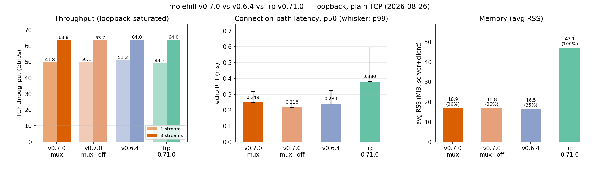

<p align="center">
  
</p>

<h1 align="center">molehill</h1>

<p align="center">
  <a href="LICENSE"></a>
  
  
  
</p>
<p align="center">
  
  
  
</p>

<p align="center">[rathole](https://github.com/rapiz1/rathole) 的社区维护 fork 版本。</p>

[English](README.md) | [简体中文](README.zh.md)

molehill，类似于 [frp](https://github.com/fatedier/frp) 和 [ngrok](https://github.com/inconshreveable/ngrok)，可以将 NAT 后的设备上的服务通过具有公网 IP 的服务器暴露到互联网。

<!-- TOC -->

- [molehill](#molehill)
  - [特性](#特性)
  - [快速开始](#快速开始)
  - [部署](#部署)
    - [二进制](#二进制)
    - [systemd](#systemd)
    - [容器](#容器)
  - [配置](#配置)
  - [文档](#文档)
  - [开发](#开发)

<!-- /TOC -->

## 特性

- **高性能** 具有更高的吞吐量，高并发下更稳定。
- **低资源消耗** 内存占用远低于同类工具。[二进制文件最小](docs/build-guide.md)可以到 **~500KiB**，可以部署在嵌入式设备如路由器上。
- **客户端声明服务** 从 v0.7 起，服务端不再需要逐服务配置：客户端声明要暴露的内容（包括公网端口），服务端只通过 `allow_ports` 白名单和共享 `default_token` 执行策略。
- **多路复用** 默认情况下，每个服务的数据通道都作为 yamux 流跑在一条隧道连接上，省去每条连接的握手并显著减少文件描述符。设置 `mux = false` 可恢复每条通道一条连接的模式（未编译 `multiplex` 特性的精简构建始终使用该模式）。
- **安全性** 共享 token 强制鉴权，`allow_ports` 白名单限制客户端可暴露的端口。使用 Noise Protocol 可以简单地配置传输加密，而不需要自签证书。同时也支持 TLS。
- **热重载** 支持配置文件热重载，动态添加或移除端口转发服务。

## 基准测试

与上一版本及 frp 的回环对比（明文 TCP，单机拓扑
`访客 -> 服务端 -> 客户端 -> 后端`）。各工具吞吐均打满回环带宽——
真正的差异在每条连接的路径开销：



| 工具 | 单流 (Gbit/s) | 8 流 (Gbit/s) | echo RTT p50 | echo RTT p99 | 内存（平均 RSS） | 占 frp 比例 |
|---|---|---|---|---|---|---|
| **molehill 0.7.0**（mux，默认） | 49.8 | 63.8 | **0.249 ms** | 0.319 ms | **16.9 MiB** | **35.8%** |
| molehill 0.7.0（`mux = false`） | 50.1 | 63.7 | 0.218 ms | 0.259 ms | 16.8 MiB | 35.7% |
| molehill 0.6.4 | 51.3 | 64.0 | 0.239 ms | 0.325 ms | 16.5 MiB | 35.0% |
| frp 0.71.0 | 49.3 | 64.0 | 0.380 ms | 0.594 ms | 47.1 MiB | 100% |

- 多路复用开启（默认）时，连接路径延迟比 frp **p50 低约 35%，p99 低约 46%**。
- 内存为服务端 + 客户端在回环 iperf3 流量下采样的常驻内存（RSS）；
  molehill 的内存占用约为 frp 的 **35%**（越低越好）。
- 吞吐已打满回环、各工具统计上无差异，仅作为上限参考。
- 复现方式：`benches/scripts/bench/run_bench.sh`
  （原始数据 `benches/scripts/bench/results-v0.7.0.json`，绘图 `plot_bench.py`）。

## 快速开始

一个全功能的 `molehill` 可以从 [release](https://github.com/NIyueeE/molehill/releases) 页面下载。或者 [从源码编译](docs/build-guide.md) **获取其他平台和最小化的二进制文件**。

`molehill` 的使用和 frp 非常类似：转发服务由客户端声明，服务端只配置共享 token 和端口策略。

使用 molehill 需要一个有公网 IP 的服务器，和一个在 NAT 或防火墙后的设备，其中有些服务需要暴露在互联网上。

假设你在家里的 NAT 后面有一个 NAS，并且想把它的 ssh 服务暴露在公网上：

1. 在有一个公网 IP 的服务器上

创建 `server.toml`，内容如下，并根据你的需要调整。

```toml
# server.toml
[server]
bind_addr = "0.0.0.0:2333" # `2333` 配置了服务端监听客户端连接的端口
default_token = "change-me" # 共享 token，客户端必须一致
allow_ports = ["5202"] # 允许客户端注册的公网端口
```

然后运行:

```bash
./molehill server.toml
```

2. 在 NAT 后面的主机上（你的 NAS）

创建 `client.toml`，内容如下，并根据你的需要调整。

```toml
# client.toml
[client]
remote_addr = "myserver.com:2333" # 服务器的地址，端口必须和 `server.bind_addr` 中的端口一致
default_token = "change-me" # 必须和服务端一致才能通过验证

[client.services.my_nas_ssh]
local_addr = "127.0.0.1:22" # 需要被转发的服务地址
remote_bind_addr = "0.0.0.0:5202" # 在服务端暴露的公网地址
```

然后运行:

```bash
./molehill client.toml
```

3. 现在客户端会尝试连接服务器的 `myserver.com:2333`，任何访问 `myserver.com:5202` 的流量都会被转发到客户端的 `22` 端口。

这样你就可以通过 `ssh myserver.com:5202` 来 ssh 到你的 NAS。

如果想在 Linux 上把 `molehill` 作为后台服务运行，可以参考
[systemd 示例](./examples/systemd) 或
[容器示例](./examples/container)。

## 配置

`molehill` 会根据配置文件自动判断运行模式（server/client），也可以通过 `--server` / `--client` 强制指定。完整的配置规范、日志和调优选项见
[配置文档](./docs/configuration.md)。[示例配置](./examples) 覆盖了各种常见场景。

## 部署

### 二进制

从 [release 页面](https://github.com/NIyueeE/molehill/releases) 下载对应平台的预编译二进制，或者
[从源码编译](./docs/build-guide.md) 获取其他平台和最小化的二进制。

```bash
./molehill server.toml   # 在公网服务器上
./molehill client.toml   # 在 NAT 后的设备上
```

### systemd

[systemd 示例](./examples/systemd) 演示了如何把 molehill 作为 systemd 服务运行，包含 root 和 rootless 两种方式，以及多实例管理。

### 容器

官方多架构镜像（linux/amd64、linux/arm64）发布在
`ghcr.io/niyueee/molehill`。镜像是构建在 `scratch` 上的单个静态 musl 二进制（约 8 MiB），以非 root UID 1000 运行，内置了 CA 证书用于 TLS 验证，并且与常规发布构建使用相同的默认特性集（包含多路复用）。

```bash
docker run -v /etc/molehill/server.toml:/app/server.toml:ro \
  ghcr.io/niyueee/molehill:latest server.toml
```

镜像内不包含任何配置——挂载你的配置文件，并把文件名作为参数传入。更多部署方式见
[容器示例](./examples/container)，包括 Docker Compose（`compose.yaml` / `compose.bridge.yaml`）和 Podman
Quadlet（`molehill-server.container` / `molehill-client.container`）。

## 文档

使用 molehill：

- [配置文档](./docs/configuration.md) — 完整的配置规范、日志和调优
- [传输层](./docs/transport.md) — TLS 和 Noise Protocol 配置
- [构建指南](./docs/build-guide.md) — 构建定制、rustls 支持、最小化二进制
- [内部原理](./docs/internals.md) — 控制通道和数据通道的工作原理
- [示例](./examples) — 常见场景的配置

贡献与工程：

- [检查门](./docs/checks.zh.md) — 每个门运行什么、被拦住时怎么办
- [Lint 策略](./docs/lint-policy.zh.md) — lint 级别与豁免规则
- [发布流程](./docs/release.zh.md) — 发布机制、版本编号、测试构建
- [仓库结构](./docs/structure.zh.md) — 仓库里每个文件的用途
- [贡献指南](./CONTRIBUTING.md) — 环境搭建与工作流
- [安全策略](./SECURITY.md) — 漏洞报告
- [`HANDOFF.md`](./HANDOFF.md) — 当前工作状态；计划中的工作和将来的设计文档

## 开发

molehill 使用 Rust 编写（2024 edition）；`rust-toolchain.toml` 声明
`channel = "stable"` 并附带 clippy 与 rustfmt 组件 —— 不要硬编码版本号。分层
git hooks 守护每次 commit 与 push，CI 运行同一条链：

```bash
just setup   # 激活 git hooks（core.hooksPath githooks）并安装检查工具
just check   # fmt / secrets / machete / docs / clippy + audit / deny / outdated / test
```

molehill 是 [rathole](https://github.com/rapiz1/rathole) 的社区 fork；版本号
沿上游序列续计（上游最后一个版本是 v0.5.0）。发布机制见
[docs/release.zh.md](./docs/release.zh.md)，仓库规则见
[AGENTS.md](./AGENTS.md)。
