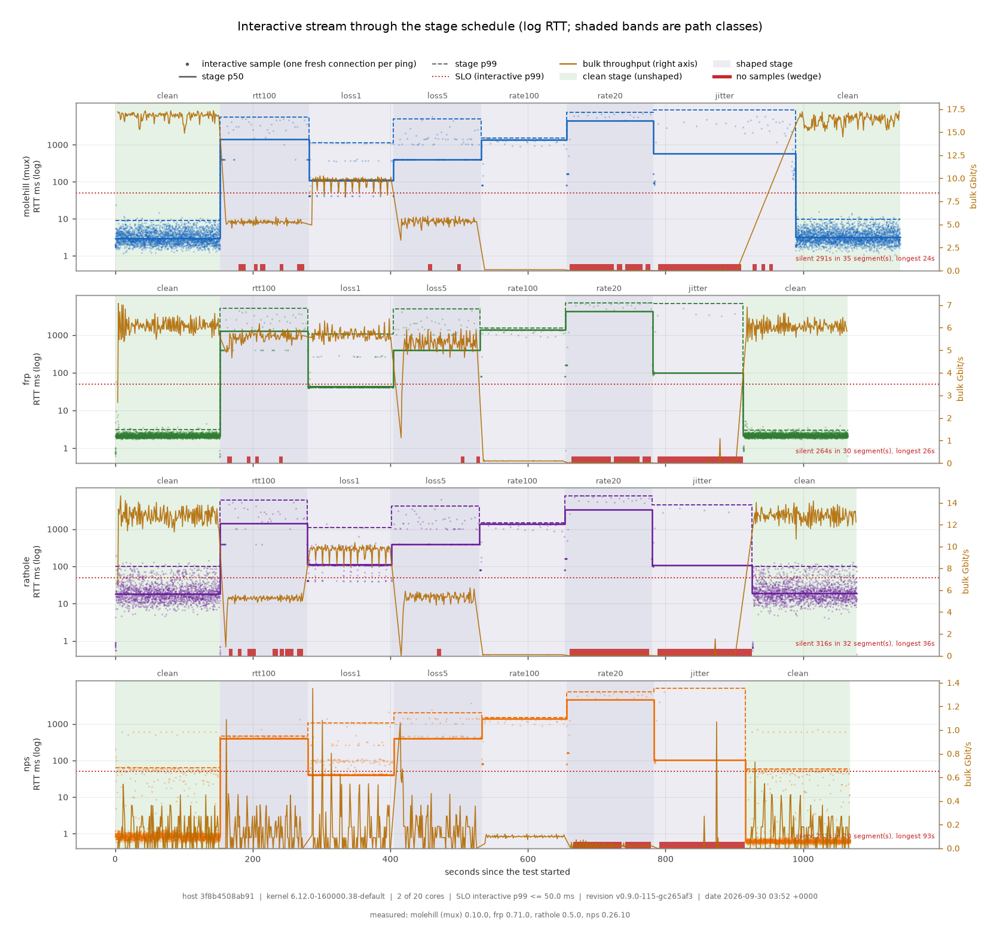
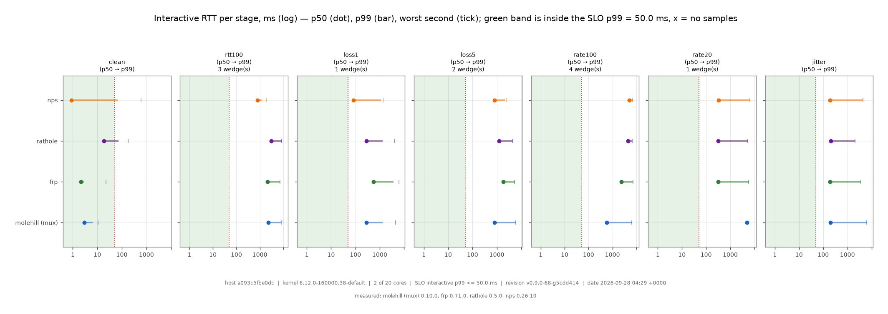

<p align="center">
  
</p>

<h1 align="center">molehill</h1>

<p align="center">
  <a href="LICENSE"></a>
  
  
  
</p>
<p align="center">
  
  
  
</p>

<p align="center">面向 NAT 穿透的安全、稳定、高性能反向代理。</p>

[English](README.md) | [简体中文](README.zh.md)

molehill，类似于 [frp](https://github.com/fatedier/frp) 和 [ngrok](https://github.com/inconshreveable/ngrok)，可以将 NAT 后的设备上的服务通过具有公网 IP 的服务器暴露到互联网。

<!-- TOC -->

- [molehill](#molehill)
  - [特性](#特性)
  - [基准测试](#基准测试)
    - [v0.10.0 一次运行](#v0100-一次运行)
  - [快速开始](#快速开始)
  - [配置](#配置)
  - [部署](#部署)
  - [文档](#文档)
  - [开发](#开发)

<!-- /TOC -->

## 特性

- **高性能** 具有更高的吞吐量，高并发下更稳定。
- **低资源消耗** 内存占用远低于同类工具。[二进制文件最小](docs/build-guide.md)可以到 **~500KiB**，可以部署在嵌入式设备如路由器上。
- **客户端声明服务** 从 v0.7 起，服务端不再需要逐服务配置：客户端声明要暴露的内容（包括公网端口），服务端只通过 `allow_ports` 白名单和共享 `default_token` 执行策略。
- **透明(L3)服务(仅 Linux)** `protocol = "transparent"` 让客户端拥有公网 `ip:port`：服务端把整个 IP 包路由进隧道，由客户端内核应答访客，因此后端看到访客的真实源地址，服务端不持有该连接的连接状态。两端都需要 TUN 设备与 `CAP_NET_ADMIN`；见[配置文档](./docs/configuration.zh.md#透明l3服务)。
- **多路复用** 每个数据通道都作为 yamux 流跑在一个弹性隧道池（上限 `[client.data.tcp|kcp].max_tunnels`，默认 4）的某条隧道上——省去每条连接的握手、显著减少文件描述符，吞吐超越单条 TCP 流并隔离队头阻塞（丢段只停滞自己的隧道）。池冷启动、按需增长，空闲的客户端不持有任何隧道；可选的 `default_carrier = "kcp"`（feature `kcp`）把数据面换成 KCP-over-UDP 会话。`[client.data]` 选项与 `mode = "direct"` 回退路径见[配置文档](./docs/configuration.zh.md)。
- **安全性** 共享 token 强制鉴权，`allow_ports` 白名单限制客户端可暴露的端口。可选的 Noise Protocol 只需一对预共享 X25519 密钥即可加密传输——没有 PKI、没有 CA；设置 `resume = true` 后，重连用一次 MAC 证明持有上次会话的握手摘要即可，不必重跑密钥交换(建连从每对 442.7 us 降到 38.5 us)。`plain` 为明文转发。
- **热重载** 支持配置文件热重载，动态添加或移除端口转发服务。

## 基准测试

单机对比(`访客 → 服务端 → 客户端 → 后端`,四跳都在同一台机器上),一切
**穿过隧道**测量:探针拨的是每个工具的暴露端口,绝不直接连它转发的后端。
方法、读图与复现:[基准测试方法](docs/benchmarks.zh.md);设置背后的决策树,
以及值得在你自己路径上测的两个数:
[配置文档](docs/configuration.zh.md#选择配置决策树)。

### v0.10.0 一次运行

每个工具都被驱以完全相同的工作负载,同时路径按阶段表推进、原地切换,会话
从不重建——下图是本主机上的 v0.10.0 一次运行,用发布二进制的默认值
(`multiplex`、明文传输);图例与阶段日程见
[基准测试方法](docs/benchmarks.zh.md#怎么读这些图)。



同一轮数据的小倍数图——每个阶段一个面板,每个工具一根棒棒糖:



**交互流 RTT p99,逐阶段**(ms)。`~` 表示**整形**档——主导它的是 harness
自己装上的队列,所以 `~` 列是背景,不在其中标出赢家;`‡` 表示该阶段还记录到了
wedge。样本数与完整读法见[基准测试方法](docs/benchmarks.zh.md#怎么读一个格子)。

| 工具 | clean | rtt100 | loss1 | loss5 | rate100 | rate20 | jitter | clean(重复) |
|---|---|---|---|---|---|---|---|---|
| molehill (mux) | 8.4 | ~5749‡ | ~1136 | ~3378 | ~1544 | ~7633‡ | ~6120‡ | 9.4 |
| frp | 2.9 | ~4904 | ~1084 | ~3558 | ~2917 | ~7670‡ | ~6297‡ | 3.0 |
| rathole | 102.3 | ~7186‡ | ~1147 | ~3716‡ | ~1595 | ~7360‡ | ~4522‡ | 104.5 |
| nps | 64.4 | ~466 | ~1096 | ~1690 | ~1543 | ~7158‡ | ~8086‡ | 66.9 |

**Bulk 吞吐逐阶段**(Gbit/s,整个测量窗口上的负载,而不是它最好的那一秒)。
`*` 标出的是取**接收侧**自己窗口的格子;`— †` 是完全没有读数的阶段,并写明
原因。哪一侧说话见[基准测试方法](docs/benchmarks.zh.md#怎么读一个格子)。

| 工具 | clean | rtt100 | loss1 | loss5 | rate100 | rate20 | jitter | clean(重复) |
|---|---|---|---|---|---|---|---|---|
| molehill (mux) | 16.830 | 5.261 | 9.727 | 5.272 | 0.100 | 0.019 | — † | 15.921 |
| frp | 6.191 | 5.540 | 5.862 | 5.306 | 0.099 | 0.019 | — † | 6.181 |
| rathole | 12.822 | 5.191 | 9.679 | 5.222 | 0.100 | 0.020 | — † | 12.867 |
| nps | 0.134 | 0.150 | 0.142 | 0.167 | 0.100 | 0.020 | — † | 0.135 |

**这一轮自己的重复实验。** 每条时间轴的首尾各测一次 `clean`,所以每个工具的
两次读数就是同一条件相隔约一小时的两个样本——其余每一格都要拿来对照的尺度:

| 工具 | clean bulk 读数 | clean 交互 p99 |
|---|---|---|
| molehill (mux) | 15.921 – 16.830 Gbit/s(**相差 5.4 %**) | 8.4 – 9.4 ms |
| frp | 6.181 – 6.191 Gbit/s(**相差 0.2 %**) | 2.9 – 3.0 ms |
| rathole | 12.822 – 12.867 Gbit/s(**相差 0.3 %**) | 102.3 – 104.5 ms |
| nps | 0.134 – 0.135 Gbit/s(**相差 0.5 %**) | 64.4 – 66.9 ms |

**它能扛多少。** 同一份产物还带着负载斜坡——一条全新的交互连接第一次打破
SLO 时的 bulk 负载档——它与阶段日程是两把不同的尺子
([基准测试方法](docs/benchmarks.zh.md#测试类型));三个臂跑满了它的全部 8 条
流,所以 8 读作**下界**("至少 8"),而不是测到的最大值:

| 工具 | 可持续流数 | 上限 | 余量 | 打破时的原因 |
|---|---|---|---|---|
| molehill (mux) | 8 | 8 | 0.0 | never broke |
| frp | 8 | 8 | 0.0 | never broke |
| rathole | 8 | 8 | 0.0 | never broke |
| nps | 0 | 8 | 1.0 | interactive p99 204.84 > 50.0 |

以上是本主机上的 v0.10.0 数字,只有同模型、同方法、同主机的运行之间才可直接
比较:每份结果文件都记录主机、方法与两个不含工具的标定,而每一轮都由它自身
的完整性、端点与 SLO 检查来判定
([基准测试方法](docs/benchmarks.zh.md#可比性))。注意 **molehill 与 rathole
都读在本主机的 loopback 上限上,并随主机的状态在各轮之间移动**:同一份未改动的
代码三轮 sweep 下来,两者的 clean 读数横跨 15.9-22.2 与 12.8-20.4 Gbit/s——摆动
达 39 % 与 59 %,足以让两者的先后反转;而比上限低一个数量级的 `frp`(6.04-6.19)
与 `nps`(0.133-0.136)变动不到 3 %。

这一轮其余的图与上面两张一起发布:`soak-v0.10.0-drift.png`(整轮运行中打开的
fd、RSS 与 CPU 斜率)、`soak-v0.10.0-udp.png`(UDP 会话的 RTT 与滑动丢包
*率*)和 `soak-v0.10.0-capacity.png`(负载爬坡)。

## 快速开始

一个全功能的 `molehill` 可以从 [release](https://github.com/NIyueeE/molehill/releases) 页面下载。或者 [从源码编译](docs/build-guide.md) **获取其他平台和最小化的二进制文件**。

`molehill` 的使用和 frp 非常类似：转发服务由客户端声明，服务端只配置共享 token 和端口策略。

使用 molehill 需要一个有公网 IP 的服务器，和一个在 NAT 或防火墙后的设备，其中有些服务需要暴露在互联网上。

假设你在家里的 NAT 后面有一个 NAS，并且想把它的 ssh 服务暴露在公网上：

1. 在有一个公网 IP 的服务器上

创建 `server.toml`，内容如下，并根据你的需要调整。

```toml
# server.toml
[server]
default_token = "use_a_secret_that_only_you_know" # 与客户端共享的密钥 # security-scan:allow documentation placeholder

# 动态注册的总开关：只有这里覆盖的端口才能被客户端占用
allow_ports = ["5202"]

[server.control]
bind_addr = "0.0.0.0:2333" # molehill 监听客户端连接的端口
```

然后运行:

```bash
./molehill server.toml
```

2. 在 NAT 后面的主机上（你的 NAS）

创建 `client.toml`，内容如下，并根据你的需要调整。

```toml
# client.toml
[client]
default_token = "use_a_secret_that_only_you_know" # 必须和服务端的 `default_token` 一致 # security-scan:allow documentation placeholder

[client.control]
default_remote_addr = "myserver.com:2333" # 服务器的地址，端口必须和 `server.control.bind_addr` 中的端口一致

[client.services.my_nas_ssh]
local_addr = "127.0.0.1:22" # 需要被转发的服务地址
remote_bind_addr = "0.0.0.0:5202" # 在服务端暴露的公网地址
```

然后运行:

```bash
./molehill client.toml
```

启动时客户端会在服务端注册 `my_nas_ssh`，服务端按 `allow_ports` 校验端口并开始转发。在 `client.toml` 中增删服务会通过热重载即时生效——无需改动服务端配置。

3. 现在客户端会尝试连接服务器的 `myserver.com:2333`，任何访问 `myserver.com:5202` 的流量都会被转发到客户端的 `22` 端口。

这样你就可以通过 `ssh -p 5202 myserver.com` 来 ssh 到你的 NAS。

如果想在 Linux 上把 `molehill` 作为后台服务运行，可以参考
[systemd 单元](./docs/deployment.zh.md#systemd) 或
[容器部署](./docs/deployment.zh.md#容器)。

## 配置

`molehill` 会根据配置文件自动判断运行模式（server/client），也可以通过 `--server` / `--client` 强制指定。完整的配置规范、日志和调优选项见
[配置文档](./docs/configuration.zh.md),其中也包含覆盖各种常见场景的
[完整示例](./docs/deployment.zh.md#完整示例)。

## 部署

同一个二进制跑在两端；模式由配置文件决定：

```bash
./molehill server.toml   # 在公网服务器上
./molehill client.toml   # 在 NAT 后的设备上
```

可直接使用的配置示例、systemd 单元与容器配方见[部署文档](./docs/deployment.zh.md)，
其中也包含网络要求与部署安全说明。

## 文档

给部署和使用 molehill 的人：

- [配置文档](./docs/configuration.zh.md) — 完整的配置规范、日志和调优
- [部署文档](./docs/deployment.zh.md) — 可直接使用的配置、systemd 单元与容器配方
- [传输层](./docs/transport.zh.md) — Noise Protocol 配置
- [基准测试](./docs/benchmarks.zh.md) — 已发布数字是怎么测出来的、怎么读、怎么复现

给改动这个仓库的人(贡献与治理类文档按决定只保留英文,见
[AGENTS.md](./AGENTS.md) §3):

- [检查门](./docs/checks.md) — 每个门运行什么、被拦住时怎么办
- [Lint 策略](./docs/lint-policy.md) — lint 级别与豁免规则
- [发布流程](./docs/release.md) — 发布机制、版本编号、测试构建
- [仓库结构](./docs/structure.md) — 仓库里每个文件的用途
- [构建指南](./docs/build-guide.md) — 构建定制、最小化二进制
- [内部原理](./docs/internals.md) — 控制通道和数据通道的工作原理
- [贡献指南](./CONTRIBUTING.md) — 环境搭建与工作流
- [安全策略](./SECURITY.md) — 漏洞报告
- [`HANDOFF.md`](./HANDOFF.md) — 当前工作状态；计划中的工作和将来的设计文档

## 开发

molehill 使用 Rust 编写（2024 edition）；`rust-toolchain.toml` 声明
`channel = "stable"` 并附带 clippy 与 rustfmt 组件 —— 不要硬编码版本号。
每个门运行什么、被拦住时怎么办，见[检查门](./docs/checks.md)。

```bash
just setup   # 激活 git hooks（core.hooksPath githooks）并安装检查工具
just check   # fmt / secrets / machete / docs / ruff(check + format) / clippy + audit / deny / outdated / test
just tag     # 发布审查（githooks/pre-tag）+ 创建本地 v* tag
```

molehill 是一个独立项目，最初从 [rathole](https://github.com/rapiz1/rathole) fork
而来；每个版本的变化见 [CHANGELOG.md](./CHANGELOG.md)，仓库规则见
[AGENTS.md](./AGENTS.md)。
